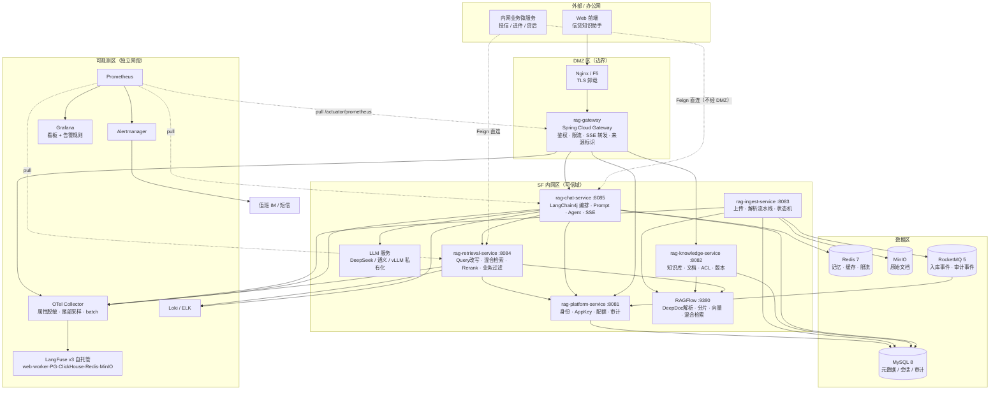
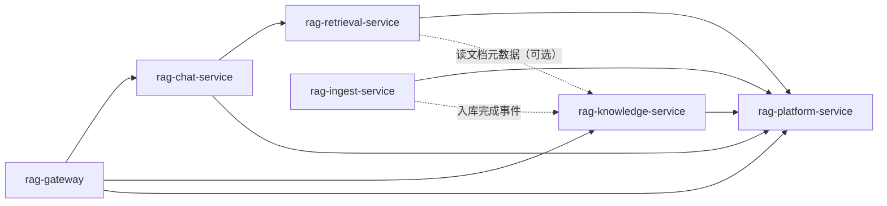
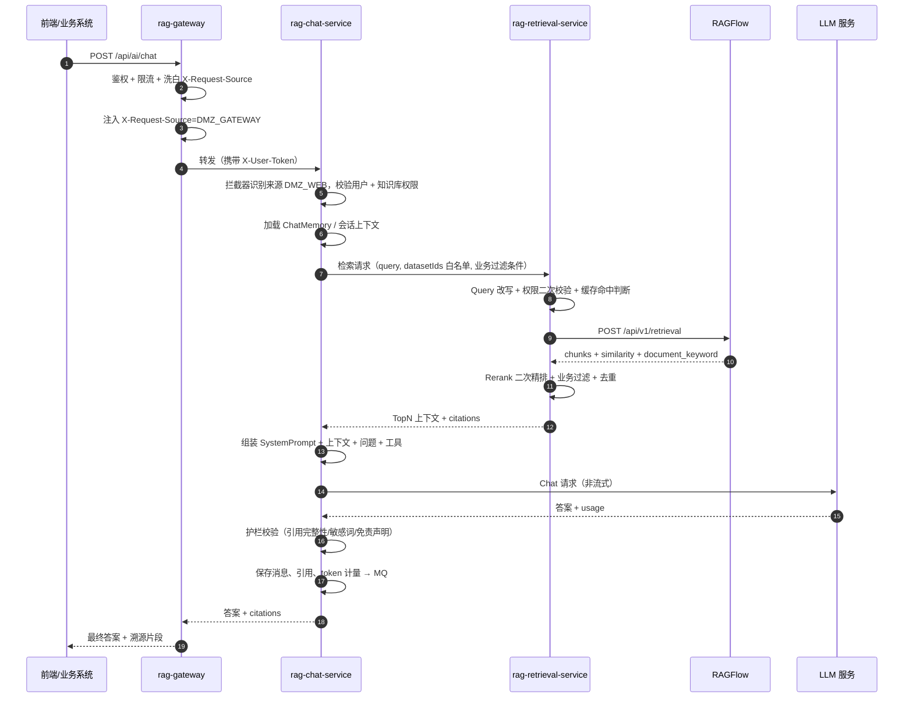
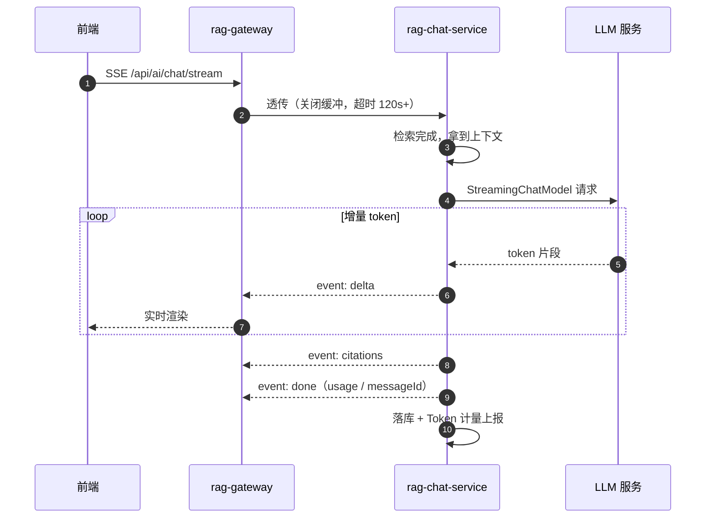
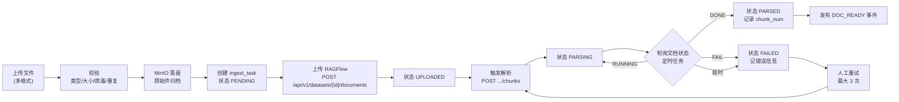
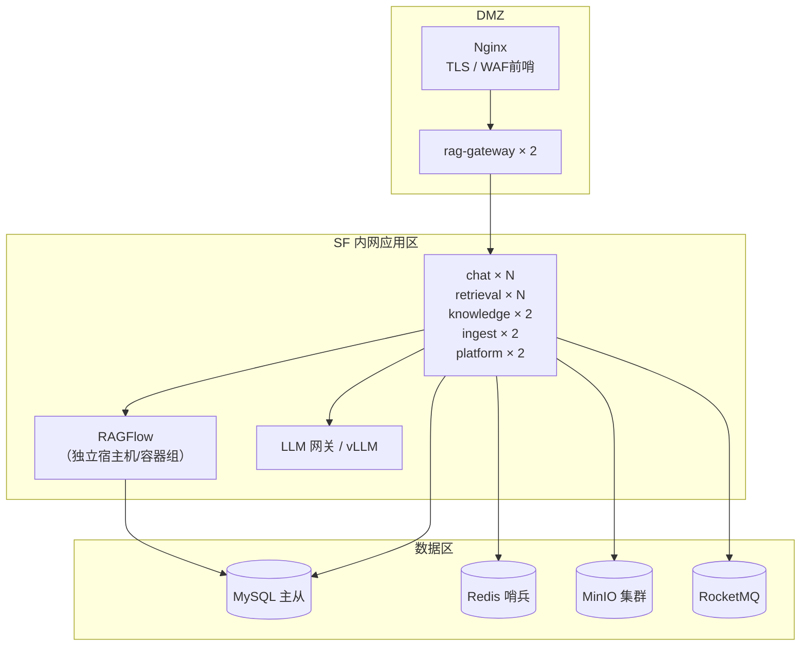

# 金融信贷知识库（RAG）微服务架构与技术落地方案

| 项 | 内容 |
|---|---|
| 文档版本 | v1.1 |
| 编制角色 | 企业级 Agent 平台架构师 |
| 目标读者 | Java 研发团队、架构评审组、运维/安全团队、产品经理 |
| 上游输入 | 《SpringBoot + RAGFlow + LangChain4j 混合架构说明》（附件 rag-1.txt）；《大模型监控方案》（附件 monitor-1.txt，评审结论见文档 05） |
| 落地基线 | JDK 17 / Spring Boot 3.x / 私有化单租户 / RAGFlow 纯检索 + LangChain4j 编排 |
| 关联文档 | 02-PRD、03-数据模型与接口契约、04-工程骨架与实施路线、**05-AI可观测与运维监控方案** |

**修订记录**

| 版本 | 变更 | 影响章节 |
|---|---|---|
| v1.0 | 首版：分层模型、服务拆分、链路设计、安全与 SLO | 全文 |
| v1.1 | 增补 **AI 可观测与运维监控**：新增观测栈决策（D5）、架构图叠加观测区、版本基线补观测组件、§7 由「一张表」扩为 L0–L5 分层、风险与安全清单补观测条目 | §0、§1.1、§2.1、§2.2、§3.1、§7、§8、§9、§10、§11、§12 |

> 可观测方案的完整设计（选型对比、埋点规范、内容采集分级、采样与成本、评估闭环、告警看板、部署与降级演练）见 **`docs/05-AI可观测与运维监控方案.md`**。本文只保留架构级结论与决策，避免两处维护同义内容。


---

## 0. 结论摘要（TL;DR）

1. **附件里的四层骨架是对的**：`前端 → DMZ 网关 → 内网 AI 微服务 → RAGFlow → LLM`。本方案在此基础上，把「内网 AI 微服务」从单体拆成 **6 个可独立部署的服务 + 2 个库模块**，并新增一条架构加强项：AI 编排层不直连 RAGFlow，而是经 `rag-retrieval-service` 统一收口检索。
2. **两套鉴权体系必须落地**：外网用户身份（JWT）与内网应用身份（AppKey + HMAC 签名）分流，靠网关注入的 `X-Request-Source` 区分，并配套防伪造三道闸。这是本方案安全设计的核心。
3. **RAGFlow 只做检索器，不做生成**（附件模式①）：Java 侧完整掌控 Prompt、Agent、业务数据拼接、引用渲染。原因：信贷场景要求「答案必须可溯源 + 可叠加业务过滤（机构/产品/生效期）+ 可挂业务工具」。
4. **代价要提前认领**：拆 6 个服务意味着 6 套 CI/CD、6 份配置、跨服务排障链路变长。**若团队 < 5 人，建议先按 §4.4 的「3 服务起步版」上线，再按拆分路线演进。**
5. **信贷合规是天花板约束**：审计日志留存、敏感信息脱敏、检索越权防护、「无据不答」护栏，这四项不是加分项而是准入门槛，已内建到架构里（§10）。
6. **可观测要分两层，别指望一个平台包打天下**：指标/链路（Prometheus + OTel）解决「系统健康」，AI 业务观测与评估（LangFuse）解决「回答质量」。**LangFuse 要用，但它只是 L3 层，不是监控的全部，更不是控制面**；6 个业务服务**不持有** LangFuse 密钥，统一经 OTel Collector 出口（§7，详见文档 05）。
7. **链条最容易断在 Feign 上**：Spring Cloud OpenFeign 在 Boot 3 下**不会自动透传 `traceparent`**，必须显式引入 `io.github.openfeign:feign-micrometer`。缺失时网关到第一个服务的链路是好的，只有服务间跳转断掉，属于「日志里每行都有 traceId 却串不成一条链」的静默故障（§7.3）。

---

## 1. 前提与约束

### 1.1 已确认的决策（本次拍板）

| # | 决策项 | 结论 | 对架构的直接影响 |
|---|---|---|---|
| D1 | 部署与租户形态 | **私有化单租户** | 不做 tenant_id 全链路穿透；权限用「部门/角色/知识库」三级；不需要计费与租户配额引擎 |
| D2 | 知识库底座 | **RAGFlow 纯检索 + LangChain4j 编排**（附件模式①） | RAGFlow 只暴露 `/api/v1/retrieval` 与文档管理 API；生成链路由 Java 掌控 |
| D3 | 交付范围 | 技术方案 + PRD + 代码骨架 | 不含完整业务实现，骨架可编译、接口可自测 |
| D4 | 基础设施 | Nacos + Spring Cloud Gateway + DeepSeek/通义 | 服务发现/配置走 Nacos；边界网关走 SCG；模型走 OpenAI 兼容协议 |
| D5 | **可观测与 AI 评估栈** | **Micrometer Tracing + OTel Collector + Prometheus/Grafana/Alertmanager（系统健康）+ LangFuse v3 自托管（AI 业务观测与评估）** | 应用统一只上报 OTel Collector；Prometheus 走 pull 直拉 `/actuator/prometheus`；**LangFuse 密钥只配在 Collector，6 个业务服务零持有**；生产默认只采集指标不回传内容（`METRICS_ONLY`） |
| D6 | **链路标识标准** | **W3C Trace Context（`traceparent`），traceId 为 32 位小写 hex** | 网关是链路唯一根，客户端传入的 `traceparent` 一律洗白；内网 Feign 必须引入 `feign-micrometer` 才能跨服务透传 |

### 1.2 我替你做的假设（如有偏差请回退调整）

| # | 假设 | 影响面 | 若假设不成立 |
|---|---|---|---|
| A1 | 知识库文档总量 1 万～20 万页，日均提问 1000～5000 次 | 容量规划、ES 规格 | 量级放大 10 倍需改 RAGFlow 为集群 + 检索独立扩容 |
| A2 | 部署在自有 IDC/专有云，具备 DMZ / SF 内网 / 数据区三区网络隔离 | 部署拓扑、网络策略 | 若是单区部署，DMZ 网关可退化为逻辑隔离，但安全评级下降 |
| A3 | 已有统一身份源（LDAP / 企业 SSO / 统一认证平台） | 用户体系、SSO 集成 | 若没有，需补建用户管理模块（增加约 1 人月） |
| A4 | 团队规模 5～10 人，具备 Spring Cloud 微服务经验 | 拆分粒度、里程碑 | 团队 < 5 人 → 走 §4.4 三服务起步版 |
| A5 | 模型可走「敏感数据私有化 + 通用问题云模型」双通道 | 模型路由设计 | 若全量私有化，需追加 GPU 资源与效果调优预算 |

### 1.3 待确认事项（不阻塞开工，但需在详细设计评审前闭环）

| # | 待确认 | 为什么重要 | 建议决策时点 |
|---|---|---|---|
| Q1 | 统一身份源的具体协议（OIDC / CAS / 自研 Token） | 决定 rag-platform 是自建用户体系还是仅做令牌转换 | 详细设计前 |
| Q2 | 模型选型与私有化边界（哪些问题严禁出内网） | 决定 LlmRouter 分流规则、模型评测方案 | Sprint 1 内 |
| Q3 | 审计日志留存年限与归档介质（监管通常要求 6 个月～5 年） | 决定存储容量与冷热分层 | 详细设计前 |
| Q4 | 是否需要「多轮对话可复现」——即按历史任意轮重新生成答案 | 决定是否需快照检索上下文与 Prompt 版本号 | Sprint 2 内 |
| Q5 | 是否已有 Milvus/ES 存量资产可复用 | 本方案默认不复用（附件明确不推荐双向量库） | 详细设计前 |

---

## 2. 架构总览

### 2.1 L1–L5 分层模型

| 层 | 名称 | 本方案的落地内容 | 关键约束 |
|---|---|---|---|
| L1 | 接入层 | Nginx/LB → `rag-gateway`；面向 Web 前端、内网业务微服务、开放 API 三类调用方 | 只做流量与安全，**不承载任何 RAG/LLM 业务逻辑** |
| L2 | 编排层 | `rag-chat-service`（LangChain4j 编排）、`rag-ingest-service`（入库流水线） | 编排层可编排，但不得直接持有向量库连接 |
| L3 | 能力层 | `rag-retrieval-service`（检索）、`rag-knowledge-service`（知识资产）、`rag-platform-service`（身份/ACL/审计） | 每个能力服务单一职责，横向调用只允许「编排层 → 能力层」单向 |
| L4 | 模型与基础设施层 | RAGFlow、LLM（DeepSeek/通义/私有化）、MySQL、Redis、MinIO、RocketMQ、Nacos | RAGFlow/LLM 仅内网可达，DMZ 不可直达 |
| L5 | 治理与安全层 | 网关鉴权、应用签名、知识库 ACL、越权召回防护、答案护栏、审计日志、限流熔断、沙箱（工具调用白名单） | 横切关注点下沉到 rag-common + rag-platform，禁止各服务各写一套 |

**可观测不是「第 6 层」，而是贯穿 L1–L5 的横切能力**，落地时按下面四层拆（详见文档 05）：

| 观测层 | 解决什么问题 | 技术落点 | 归属 |
|---|---|---|---|
| **L0 控制面** | 出问题时能不能「关得住、限得住、切得走」 | 网关限流/配额、Sentinel 熔断、`LlmRouter` failover、采集档位开关 | 已有能力盘点见文档 05 §4 |
| **L1 指标** | 系统健不健康、趋势是否异常 | Micrometer → Prometheus → Grafana → Alertmanager | 6 个服务 |
| **L2 链路** | 一次慢/错到底卡在哪一跳 | Micrometer Tracing + OTLP → OTel Collector（脱敏 + 尾部采样） | 6 个服务 |
| **L3 AI 业务观测与评估** | 答得对不对、贵不贵、敢不敢发版 | LangFuse v3（自托管）＋ 本地留档表 `t_llm_eval_score` | 仅 Collector 出口 |
| **L4 日志** | 具体上下文（不含原文） | Logback JSON → Loki/ELK，MDC 带 traceId | 6 个服务 |

### 2.2 全景架构图



**读图五个要点**

- `SUBSYSTEM` 内网业务微服务调用 AI 能力走 **Feign 直连 + 服务发现**，不绕 DMZ 网关（附件「方案一」，起步推荐）；DMZ 网关只服务外网前端。
- **DMZ 与 SF 内网之间只有一条通路**：`GW → CHAT/KNW/PLT`。DMZ 侧无任何组件可直达 RAGFlow / LLM / 数据库。
- 数据区不与 DMZ 发生任何连接。
- **观测数据是单向流出**：6 个服务 → OTel Collector → LangFuse；观测区不反向调用业务服务。Prometheus 是 **pull 模型**（直拉各服务 `/actuator/prometheus`），**不存在「Collector 把指标 push 给 Prometheus」这种数据流**（这是附件里第 5 条硬伤，详见文档 05 §1.2）。
- **`/actuator/**` 不经网关暴露**：网关 public-paths 只放行 `/actuator/health`，`prometheus/metrics/env/heapdump` 一律由内网采集器直连端口拉取。

---

## 3. 技术栈与选型

### 3.1 版本基线（2026-09 核对，落地时请以 start.spring.io + mvnrepository 实时版本为准）

| 组件 | 版本基线 | 说明 |
|---|---|---|
| JDK | **17（LTS）** | 本机已具备 Temurin 17.0.20；如需虚拟线程可升 21 |
| Spring Boot | **3.5.x** | 3.x 线最新稳定分支 |
| Spring Cloud | **2025.0.x** | 与 Boot 3.5.x 配套 |
| Spring Cloud Alibaba | **2025.0.x** | Nacos / Sentinel 官方适配组合 |
| LangChain4j | **1.20.x** | 只用 `langchain4j` + `langchain4j-open-ai` 两个基础包，**刻意不用 spring-boot-starter**（模型需从配置中心动态路由，starter 的静态装配表达不了） |
| Nacos | 2.4.x / 3.x | 注册中心 + 配置中心（生产用 MySQL 存储） |
| Sentinel | 1.8.x | 限流 / 熔断 / 热点参数（SCA 原生集成） |
| MyBatis-Plus | 3.5.9+ | **必须用 `mybatis-plus-spring-boot3-starter`**，用旧 starter 会启动失败 |
| MySQL | 8.0.x | 4 个逻辑库 |
| Redis | 7.x | Lettuce + Redisson 3.4x（分布式锁、限流桶） |
| RocketMQ | 5.1.x | 入库事件、审计事件、Token 计量上报 |
| MinIO | RELEASE 最新 | 原始文档对象存储。**RAGFlow 自带 MinIO，生产建议独立部署一套**，避免升级耦合 |
| RAGFlow | 最新稳定版 | Docker Compose 起，默认 ES 作为文档引擎 |
| 可观测（应用侧） | Micrometer Tracing 1.5.x + `micrometer-tracing-bridge-otel`、`opentelemetry-exporter-otlp`、`micrometer-registry-prometheus`、**`io.github.openfeign:feign-micrometer`** | Spring Cloud Sleuth 已废弃，统一走 Micrometer Tracing。**`feign-micrometer` 不是可选项**：缺它 Feign 调用不带 `traceparent`，跨服务链路静默断裂（见 §7.3） |
| 可观测（底座） | OTel Collector Contrib、Prometheus 2.5x、Alertmanager、Grafana 11.x | Collector 负责属性脱敏 + 尾部采样 + 双出口（LangFuse / debug）；Prometheus 走 pull |
| AI 业务观测 | **LangFuse v3 自托管**（langfuse-web / worker + PostgreSQL + ClickHouse + Redis + MinIO） | 六件套缺一不可（**对象存储是必需组件**，附件漏了）；接入只走 OTLP `/api/public/otel/v1/traces` + Basic Auth，**不用 2026-11-16 日落的旧 Ingestion API** |
| 日志聚合 | Loki 3.x（或复用既有 ELK） | Logback JSON；MDC 只带 traceId/spanId/subjectHash 等，**不带问答原文** |
| API 文档 | springdoc-openapi 2.x + Knife4j 4.x | 网关聚合各服务文档 |
| 其他 | JJWT 0.12.x、MapStruct 1.6.x、Lombok、Flyway | **JJWT 0.12 与 0.11 API 不兼容**，注意写法 |

### 3.2 关键组件选型对比

#### 3.2.1 知识库底座

| 方案 | 优点 | 缺点 | 成本 | 适用场景 |
|---|---|---|---|---|
| **RAGFlow 纯检索 + LangChain4j 编排（推荐/已选）** | Java 侧完整掌控 Prompt/Agent/业务拼接；可叠加业务过滤；引用渲染自主可控 | 引用渲染、上下文拼装需自研；RAGFlow 检索参数需自测调优 | 中（多 1 个检索服务的开发量） | **信贷场景要求可溯源 + 业务规则介入生成** |
| RAGFlow 全托管（附件模式②） | 代码最少，页面调参即可优化检索 | Java 无法介入「检索后—生成前」；Agent 能力受限；回答风格难以贴合信贷合规话术 | 低 | 内部资料问答，无强合规要求 |
| 自建 Milvus + LangChain4j 自建 RAG | 检索链路完全可控，可自定义召回算法 | 文档解析（表格/影印件）要自研，是 RAGFlow 最强的地方；两套向量库一致性难保障 | 高 | 已有成熟解析能力且有算法团队 |

> **决策理由**：信贷知识库的文档形态以监管文件、产品说明书、内部制度为主，**表格与影印件占比高**，RAGFlow 的 DeepDoc 解析是买不到的能力；而「答案必须能指到原文第几页」是合规硬要求，必须由 Java 侧掌控引用渲染。两者取舍下选混合模式。

#### 3.2.2 检索服务的收口方式（本方案的架构加强项）

| 方案 | 优点 | 缺点 | 结论 |
|---|---|---|---|
| 附件原方案：chat 直连 RAGFlow | 少一跳，链路短 | 检索策略散落在每个调用方；缓存/过滤/评测无法统一；RAGFlow 参数变更要改多个服务 | 备选 |
| **本方案：chat → retrieval-service → RAGFlow（推荐）** | 检索策略集中一处；可独立缓存与压测；未来检索页/报表/内网应用可直接复用；RAGFlow 演进时只改一个服务 | 多一跳 RTT（内网约 +3~8ms）；多一个服务要运维 | **推荐** |

> **诚实说明代价**：多一跳在 P95 < 400ms 的检索预算里占比可忽略，但换来的是「换掉 RAGFlow 只改一个服务」的弹性。若你的团队只有 3 人，可以把这个服务先做成一个 Spring 模块（jar），逻辑不拆、部署不拆。

#### 3.2.3 模型路由

| 方案 | 优点 | 缺点 | 结论 |
|---|---|---|---|
| 单模型直配（只写死 DeepSeek 或通义） | 实现最简单 | 供应商故障即全站不可用；无法按数据敏感度分流 | 不推荐生产 |
| **LlmRouter 配置化多模型 + 敏感度分流（推荐）** | 云模型/私有化模型双通道；可灰度切模型；供应商 failover | 需要模型评测机制与配置中心联动 | **推荐** |
| 网关层模型代理（OpenAI compatible proxy） | 统一出口、统一计量 | 无法替代 LangChain4j 的 Agent/RAG 编排能力 | 可作为可选增强，不替代应用层 |

---

## 4. 微服务拆分方案

### 4.1 拆分原则（先立规矩，再谈切法）

| 原则 | 含义 |
|---|---|
| P1 单一职责 | 一个服务只回答一个问题：谁的身份？有什么知识？怎么存进去？怎么召回来？怎么生成？ |
| P2 变化频率对齐 | 变更频率接近的能力放一起。检索策略与生成策略迭代节奏完全不同，故必须分开 |
| P3 负载模型对齐 | 长任务/重 IO（文档解析）与管理面 CRUD 分开，避免批处理打爆在线接口 |
| P4 依赖单向 | 只允许 `编排层 → 能力层 → 基础设施层`，禁止能力层之间环形依赖 |
| P5 数据私有 | 一个服务只写自己的库，跨服务读一律走 API，禁止跨库 JOIN |
| P6 可独立伸缩 | 拆出来的服务必须能独立扩容，否则不叫微服务，叫分布式单体 |

### 4.2 服务清单（6 个可独立部署服务）

| 服务 | 端口 | 核心职责 | 独占数据 | 依赖 | 独立伸缩理由 |
|---|---|---|---|---|---|
| **rag-gateway** | 8080 | 边界网关：路由、统一鉴权、限流、SSE 转发、`X-Request-Source` 注入与洗白、访问日志 | 无 | Nacos、Redis | 流量入口，需独立于业务扩缩 |
| **rag-platform-service** | 8081 | 平台治理：用户/角色/部门、内网应用 AppKey 与签名、知识库 ACL 计算、配额限流规则、审计日志、模型与 RAGFlow 配置下发 | `t_user` `t_role` `t_app_credential` `t_kb_acl` `t_quota_rule` `t_audit_log` `t_model_config` | MySQL、Redis | 被所有服务依赖，需独立保障稳定性；审计写入量大 |
| **rag-knowledge-service** | 8082 | 知识资产：知识库 CRUD、目录/标签、文档元数据与版本、生命周期、与 RAGFlow Dataset 的映射与同步 | `t_knowledge_base` `t_document` `t_document_version` `t_kb_dataset_mapping` | MySQL、RAGFlow | 管理面服务，变更频率低、QPS 低，与在线问答隔离 |
| **rag-ingest-service** | 8083 | 入库流水线：文件校验/去重/杀毒、MinIO 落盘、RAGFlow 上传与解析、分片策略、状态机、失败重试、解析质量报告 | `t_ingest_task` `t_ingest_task_log` | MySQL、MinIO、RAGFlow、RocketMQ | **重 IO + 长任务 + 批处理**，必须与在线服务物理隔离，否则批量导入拖垮问答 |
| **rag-retrieval-service** | 8084 | 检索能力：Query 改写/扩展、RAGFlow 混合检索调用、Rerank 二次精排、业务过滤（机构/产品/生效期）、去重、缓存、召回评测 | `t_retrieval_log` `t_eval_dataset` | RAGFlow、Redis、MySQL | 检索便宜、生成贵，资源模型不同；检索可多入口复用，需独立压测 |
| **rag-chat-service** | 8085 | 问答编排：LangChain4j 编排、Prompt 组装、ChatMemory、Function Calling（信贷业务工具）、SSE 流式、引用溯源、答案护栏、Token 计量 | `t_conversation` `t_message` `t_message_citation` `t_token_usage` `t_feedback` | LLM、Redis、MySQL、retrieval、platform | 长耗时 + 高 token 成本，需按并发独立扩容与独立限流 |

### 4.3 库模块（不可独立部署）

| 模块 | 内容 | 谁依赖 |
|---|---|---|
| **rag-common** | 统一返回 `R`/`PageResult`、`BizException` + `ErrorCode`、全局异常处理、`RequestContext`/`RequestSource`、请求头常量、TraceId 工具、Jackson 配置 | 全部服务 |
| **rag-api** | 服务间契约：DTO/枚举（Java record）+ Feign Client（`@FeignClient` 接口）+ 自动装配。**同时作为内网业务微服务接入的 SDK**，业务方引这一个包即可调用 | gateway / knowledge / ingest / retrieval / chat，以及内网业务方 |

### 4.4 服务依赖拓扑与演进路线



依赖是**有向无环**的，`rag-platform-service` 位于最底层（被依赖最多），因此它必须最先保证可用性。

**演进路线（三步走，按团队规模选起点）**

| 阶段 | 形态 | 触发条件 |
|---|---|---|
| **起点：3 服务版** | `rag-gateway` + `rag-core-service`（knowledge+ingest+platform 三合一）+ `rag-ai-service`（retrieval+chat 二合一） | 团队 < 5 人，或首期只求跑通业务闭环 |
| **一阶段：4 服务版** | 拆出 `rag-retrieval-service`（因为检索需独立压测与缓存策略） | 出现「同一份知识库被问答页 + 检索页 + 内网应用同时消费」 |
| **目标：6 服务版** | 全部拆开 | 文档导入量上来（批处理影响在线）或合规要求审计独立部署 |

> **反模式提醒**：不要为了「微服务」而拆。`rag-knowledge-service` 与 `rag-ingest-service` 如果首期就拆，你会付出双倍的接口定义与联调成本，却拿不到收益。**先按 3 服务版上线，把接口契约（rag-api）设计好，后续拆分就是物理动作，不是重写。**

---

## 5. 关键链路设计

### 5.1 问答链路 —— 非流式（含两套鉴权分流）



### 5.2 问答链路 —— SSE 流式（生产主用）

与非流式的差异只有三处，其余步骤相同：

1. 前端用 `GET/POST` 建立 SSE 长连接，网关开启**透传模式**：关闭响应缓冲、超时调到 ≥ 120s、开启 chunked。
2. 检索阶段**一次性完成**（不流式），随后 LLM 增量返回 token，逐段推送 `event: delta`。
3. 流结束后追加两个事件：`event: citations`（引用列表）、`event: done`（含 token usage 与 messageId）。



> **网关侧必须显式配置**（这一步最容易踩坑）：`spring.cloud.gateway` 路由需要对 SSE 路径关闭 `ModifyResponseBody`，同时把 `spring.cloud.gateway.httpclient.response-timeout` 与 `connect-timeout` 调大，Nginx 前置层需设置 `proxy_buffering off; proxy_read_timeout 300s;`。

### 5.3 文档入库链路与状态机



| 状态 | 含义 | 可执行动作 |
|---|---|---|
| `PENDING` | 已落盘待上传 | 上传、取消 |
| `UPLOADED` | 已入 RAGFlow 待解析 | 触发解析、删除 |
| `PARSING` | 解析/向量化中 | 等待、取消 |
| `PARSED` | 可检索 | 重建索引、下线、删除 |
| `FAILED` | 解析失败 | 重试（≤3 次）、删除 |
| `OFFLINE` | 已下线不可召回 | 重新上线、删除 |

> **踩坑提醒**（来自附件）：大文档解析是异步的，**上传完立刻提问必然召回不到**。前端必须展示解析进度，后端必须做状态轮询 + 超时兜底（建议单文档超时 30 分钟判定失败）。

### 5.4 两套鉴权体系与防伪造（安全核心）

| 维度 | 外网前端流量 | SF 内网业务微服务流量 |
|---|---|---|
| 身份主体 | 终端用户（人） | 应用（服务） |
| 凭证 | DMZ 网关校验 JWT，透传 `X-User-Token` | `X-App-Id` + `X-App-Signature`（HMAC-SHA256 over 方法+路径+时间戳+body hash） |
| 来源标识 | **有** `X-Request-Source: DMZ_GATEWAY`（网关注入） | **无** |
| 限流维度 | 按用户 + 按 IP | 按 AppId（独立限流桶） |
| 权限模型 | 人维度：角色/部门 → 知识库 ACL | 应用维度：应用被授权绑定的知识库 |

**三道防伪造闸**

1. **网关洗白**：SCG 的 `RemoveRequestHeader` + `AddRequestHeader` 组合——先删掉客户端传入的 `X-Request-Source`，再注入可信值。前端无法伪造。
2. **AI 服务侧反向拦截**：如果请求**带了** `X-Request-Source: DMZ_GATEWAY`，但来源 IP 不在 DMZ 网关白名单内 → 直接 `403`。
3. **可选强校验（推荐金融客户启用）**：网关用私钥对 `X-Gateway-Signature` 签名，AI 服务用公钥验签，不依赖 IP（容器/K8s 环境 IP 会漂移，IP 白名单维护成本高）。

> **落地坑**：内网业务方 Feign 客户端的 `RequestInterceptor` **绝不能全局添加** `X-Request-Source`。在 `rag-api` 里我只提供了 AppKey 签名拦截器，来源标识一律由网关写。

### 5.5 知识库权限与越权召回防护

这是 RAG 系统最容易被忽视、但在金融场景最致命的一处漏洞——**如果只在 UI 层做权限，检索层不做校验，用户可以通过提问诱导出无权查看的文档内容。**

```
用户请求
  → rag-chat-service：解析 user_id → 调 platform 换取「可访问 dataset_id 集合」
  → rag-retrieval-service：收到 datasetIds 白名单，作为硬约束透传给 RAGFlow
  → 绝不接受前端传入的 datasetIds        ← 关键
  → 检索结果二次过滤：chunk 所属 document 的密级 ≤ 用户密级
  → 引用返回前做敏感信息脱敏
```

**四条硬规则**

1. `datasetIds` 一律由服务端根据 `user_id` 推导，**永不信任请求体中的知识库 ID**。
2. RAGFlow 的 API Key **只存在于 retrieval/knowledge/ingest 三个服务**，chat 与 gateway 不持有。
3. 文档级密级字段（`secret_level`）在检索结果过滤阶段二次校验，防止 ACL 配置滞后导致的越权。
4. 所有问答请求写入 `t_audit_log`（谁、何时、问了什么、召回了哪些文档），作为合规审计证据。

### 5.6 Prompt、护栏与「无据不答」

信贷场景的底线是**不能编造政策条款**。护栏放在 `rag-chat-service` 的 `AnswerGuardrail`：

| 护栏 | 触发条件 | 处置 |
|---|---|---|
| 空召回拦截 | 检索结果的相似度全部低于阈值 | 不调用 LLM，直接返回「知识库中未找到相关内容」，并提示可转人工 |
| 引用完整性 | 答案中出现了 `[n]` 标记但无对应 citation | 后置裁剪标记或标记为「待人工复核」 |
| 数值敏感性 | 答案含利率/额度等数值但无引用来源 | 强制追加「以上数值请以正式制度文件为准」并降权展示 |
| 敏感信息 | 疑似身份证/银行卡/手机号 | 正则 + 词典双检，命中即脱敏后输出 |
| 免责声明 | 所有对外答案 | 按产品要求追加固定声明 |
| 越权内容 | 答案涉及未授权知识库的引用 | 整条回答拦截并告警 |

### 5.7 缓存与失效策略

| 缓存对象 | Key 设计 | TTL | 失效时机 |
|---|---|---|---|
| 检索结果 | `ret:{datasetIdsHash}:{queryNormalized}:{filterHash}` | 10 min | 知识库版本号变更时按 dataset 维度批量失效 |
| 知识库 ACL | `acl:user:{userId}` | 5 min | 角色/部门变更时主动删除 |
| 应用凭证 | `app:cred:{appId}` | 30 min | AppKey 轮换时删除 |
| 会话记忆 | `chat:mem:{conversationId}` | 2 h（滑动） | 会话结束 |
| 网关限流桶 | `rl:{source}:{key}` | 按窗口 | 自动过期 |

> **检索缓存是双刃剑**：Key 里必须包含 `datasetIdsHash`，否则跨知识库权限的用户会命中彼此的缓存，**构成越权召回**。这一点在代码里体现为 `RetrievalCacheKeyBuilder`，禁止手写 Key。

### 5.8 异步与事务边界（铁律）

附件里没有展开这块，但它是分布式落地的翻车高发区。三条铁律：

1. **本地事务只包本地库**。`rag-ingest-service` 写库 + 发 MQ，用**本地消息表**保证一致性（同库同事务写 `t_ingest_task` 与 `t_outbox`，由定时任务投递 MQ）。金融场景不要用「发消息失败就重试」的裸写法。
2. **RAGFlow 不在事务内**。RAGFlow 是外部系统，调用失败只能**补偿**，不能回滚。所有对外调用都要有 `状态机 + 重试 + 人工兜底`。
3. **生成链路上的 Token 计量、审计日志一律异步**（走 MQ），不能用同步写库拖慢首字节时间。

---

## 6. 部署拓扑与网络策略



**网络访问矩阵（最小权限）**

| 源 → 目标 | 端口 | 是否放通 | 备注 |
|---|---|---|---|
| 前端 → DMZ LB | 443 | ✅ | 唯一外网入口 |
| DMZ 网关 → chat/knowledge/platform | 808x | ✅ | 仅这几个 |
| DMZ 网关 → RAGFlow / LLM / MySQL | * | ❌ | **严禁** |
| 内网业务微服务 → chat / retrieval | 8084/8085 | ✅ | 应用签名鉴权 |
| chat → retrieval / platform / LLM | 8084/8081 | ✅ | |
| retrieval/knowledge/ingest → RAGFlow | 9380 | ✅ | RAGFlow API Key 仅在这三个服务 |
| RAGFlow → LLM | 443/8000 | ✅ | 解析阶段的 embedding 与 OCR 需访问模型 |
| 应用 → MySQL/Redis/MinIO/MQ | 3306/6379/9000/9876 | ✅ | 数据区只接受内网应用区访问 |
| RAGFlow → 外网 | * | ❌ | 全离线部署，模型走内网 |

> **RAGFlow 单独说明**：官方 Docker 镜像仅 x86，ARM64 需自行构建；部署前须 `sysctl -w vm.max_map_count=262144`（否则 ES 起不来）。默认 `80` 端口建议改为内部端口并置于内网。

---

## 7. 可观测性与 SRE

> 本节只给**架构级结论与决策**。完整设计（选型对比、埋点属性表、内容采集四档、采样与成本、评估闭环、看板清单、部署与故障降级演练、上线 Checklist）见 **`docs/05-AI可观测与运维监控方案.md`**。

### 7.1 分层与选型结论

| 维度 | 方案 | 关键指标 |
|---|---|---|
| 指标 Metrics | Micrometer → Prometheus → Grafana / Alertmanager | 首字节延迟 TTFT、端到端耗时、检索耗时、LLM 耗时、token 输入/输出量、召回片段数、**空召回率**、限流拒绝数、RAGFlow 调用错误率 |
| 日志 Logs | Logback JSON → Loki/ELK | 统一 traceId 贯穿；MDC 带 `RequestSource`、`subjectHash`（不是原始 userId）、`conversationId` |
| 追踪 Traces | Micrometer Tracing + OTLP → OTel Collector | 跨 `gateway → chat → retrieval → RAGFlow → LLM` 全链路 span；模型调用按 OTel GenAI 语义约定命名 |
| AI 业务观测与评估 | **LangFuse v3 自托管**（经 Collector 出口） | 单次回答完整回放（检索片段→Prompt→生成）、Prompt 版本 A/B、LLM-as-judge 评分、标注队列 |
| 业务度量 | Grafana + LangFuse 分工 | 提问量/日活提问用户、知识库覆盖率、答案采纳率（点赞率）、无答案问题 TOP100（反哺知识库建设） |

**「是否用 LangFuse」的结论：用，但要摆正位置。**

| 判断 | 说明 |
|---|---|
| LangFuse 能解决什么 | 单次回答的**内容级回放**与**质量评估闭环** —— 这是 Prometheus/Grafana 天然做不到的（指标体系刻意不承载内容） |
| LangFuse 不解决什么 | 它**不是**系统监控，也**不是**控制面。接口延迟、JVM、连接池、限流仍看 Prometheus；「限流/熔断/切模型/降级」属 L0 控制面，与 LangFuse 无关 |
| 代价值得吗 | 多一套 6 容器有状态集群（约 14 vCPU / 18 GB）。**团队 < 5 人时建议先做 P1（Prometheus + Grafana + Alertmanager），暂不上 LangFuse**，路线见文档 05 §11 |
| 硬约束 | ① 生产默认 `METRICS_ONLY`（不落问答原文）；② LangFuse 密钥**只配在 Collector**，6 个业务服务零持有；③ 应用只上报 Collector，**不直连 LangFuse** |

### 7.2 埋点的唯一真源

- **属性名、指标名、标签名一律走 `GenAiSemconv` 常量类**，业务代码禁止写死字符串。原因：OTel GenAI 语义约定截至 2026-09 **全部处于 Development 状态**（已迁至独立仓库 `semantic-conventions-genai`，无 tag 发布），属性改名时只改一个文件、看板不必重建。
- **禁用已废弃属性**：`gen_ai.system`（改为 `gen_ai.provider.name`）、`gen_ai.content.prompt` / `gen_ai.content.completion`。
- **标签纪律**：只允许枚举型有界维度（`outcome` / `app_source` / `model_code` / `guardrail_type` / `vote` / `reason_code`）。**禁止**把 `traceId`、`userId`、`conversationId`、`query` 做成标签 —— 无界维度会打爆 Prometheus 内存。需要归因时用主体哈希或分桶。
- 上述三条已写入 `tools/check_skeleton.py`，作为 CI 结构门禁自动校验。

### 7.3 跨服务透传：最容易断的一环

**Spring Cloud OpenFeign 在 Boot 3（Micrometer Tracing）下不会自动透传 `traceparent`**。只有 classpath 上存在 `io.github.openfeign:feign-micrometer` 时，其 `FeignClientsConfiguration.MicrometerConfiguration` 才会装配 `MicrometerObservationCapability` 与 `PropagatingSenderTracingObservationHandler`。

| 现象 | 根因 | 处置 |
|---|---|---|
| 网关 → chat 的链路正常，但 chat → retrieval 另起一条新链路 | 缺 `feign-micrometer` | 所有声明 openfeign 的模块显式引入该依赖 |
| 日志里每行都有 traceId，却串不成一条链 | 同上（最典型的误判为「埋点没生效」） | 同服务 `TracePropagationInterceptor` 已内置**启动期体检**：检测到 Feign 但缺该依赖时直接打 **ERROR** 并打印修复片段 |
| 下游不认网关发来的 `traceparent` | W3C 规范下 **span-id 全零属非法值** | `TraceIds.formatTraceparent` 已自动替换为合规随机 spanId |

另外两处必须锁死：`management.tracing.propagation.type: w3c`（显式声明，防退回 b3），以及网关 `InboundTraceSanitizeWebFilter` 的 order **恰为** `HIGHEST_PRECEDENCE`（必须早于 Boot 观测过滤器的 `HIGHEST_PRECEDENCE + 1`，否则客户端伪造的 traceparent 已被采纳为父上下文）。

### 7.4 告警阈值（建议基线）

| 告警 | 条件 | 级别 |
|---|---|---|
| 空召回率突增 | 15 分钟内空召回率 > 30% | P2 |
| 检索 P95 超时 | 检索 P95 > 1s 持续 5 分钟 | P2 |
| LLM 调用失败率 | > 5% 持续 5 分钟 | P1 |
| **首字延迟劣化** | TTFT P95 > 3s 持续 10 分钟 | P1 |
| 网关限流拒绝率 | > 10% | P2 |
| 文档解析失败堆积 | FAILED 任务数 > 20 | P3 |
| Token 消耗异常 | 单小时消耗 > 基线 3 倍 | P2（防刷/防跑飞） |
| **护栏拦截率突增** | `rag_guardrail_hit_total` 环比翻倍 | P2（可能是知识库缺口或注入攻击） |
| **观测底座不可用** | Collector / Prometheus 连续 5 分钟无数据 | P2（盲飞预警，不是业务故障） |

> 前 2 周建议**只观测不告警**，按实测 P95 校准阈值后再启用，否则初期必然产生告警疲劳（文档 05 风险 O7）。

---

## 8. 安全与合规清单

| # | 要求 | 落地方式 | 责任服务 |
|---|---|---|---|
| S1 | API Key 不得出现在前端 | 所有 RAGFlow/LLM 调用一律后端代理 | gateway 设计约束 |
| S2 | 内网应用调用可追溯 | AppKey + HMAC 签名 + 时间戳防重放（±5 分钟窗口） | platform + rag-common |
| S3 | 越权召回防护 | datasetIds 服务端推导 + 密级二次过滤 | chat + retrieval |
| S4 | 提示词注入防护 | 上下文与用户输入结构化隔离（明确分隔标签）、禁止上下文携带指令、工具调用白名单 | chat |
| S5 | 数据脱敏 | 输出侧正则+词典双检脱敏 | chat |
| S6 | 审计合规 | 全量问答审计、留存可配置（默认 6 个月）、按人可查 | platform |
| S7 | 敏感数据不出内网 | LlmRouter 按数据敏感级路由到私有化模型 | chat |
| S8 | 工具调用沙箱 | Function Calling 只暴露只读业务查询工具，白名单 + 参数校验 + 超时 | chat |
| S9 | 依赖安全 | 统一 BOM 锁版本，定期 OWASP 依赖扫描 | 全部 |
| S10 | 文档病毒扫描 | 上传必经 ClamAV 扫描后落盘 | ingest |
| S11 | **追踪头不可伪造** | 网关在 WebFilter 层（`HIGHEST_PRECEDENCE`）先删客户端 `traceparent` 再自行生成；客户端传入值一律不采纳 | gateway |
| S12 | **观测数据不落问答原文** | 生产默认 `METRICS_ONLY` 档位；`FULL_CONTENT` 受 `allow-plain-text-content` 防呆闸约束（默认 false，误配也只会降级为脱敏档） | 6 个服务 |
| S13 | **观测平台凭据收敛** | LangFuse 密钥只配置在 OTel Collector，业务服务零持有；应用只上报 Collector，不直连 LangFuse | deploy/observability |
| S14 | **管理端口不对外** | 网关 public-paths 只放行 `/actuator/health`；`prometheus`/`metrics`/`env`/`heapdump` 由内网采集器直连端口拉取 | gateway |
| S15 | **告警文本可外发** | Alertmanager 出内网的告警只允许含指标名、阈值、当前值、traceId、服务名；禁止含问答原文与用户身份 | 运维 |

---

## 9. 非功能指标（SLO 基线）

| 指标 | 目标值 | 备注 |
|---|---|---|
| 问答首字节时间（流式 TTFB） | P95 ≤ 1.5s | 检索 + Prompt 组装完成后首个 token |
| 完整答案耗时 | P95 ≤ 8s（500 字答案） | 强依赖模型侧 |
| 检索耗时（不含 LLM） | P95 ≤ 400ms | 含 RAGFlow 调用 + Rerank |
| 单文档解析 | ≤ 3 min / 100 页 PDF | 与 RAGFlow 资源相关 |
| 检索吞吐 | 单实例 50 QPS | 可水平扩容 |
| 生成吞吐 | 单实例 10 QPS（并发） | 受 LLM 侧 QPS 制约 |
| 系统可用性 | 99.9% | 网关与 platform 需多实例 |
| 审计日志留存 | ≥ 6 个月 | 按合规要求调整 |
| 知识库召回准确率 | Top5 命中率 ≥ 85% | 需建立评测集持续回归 |
| 链路可观测覆盖率 | 关键路径 100% 有 span；错误/无据/护栏/慢请求 100% 被采样保留 | 头部降采样 + **尾部强制执行**，顺序不可颠倒 |
| 可观测自身开销 | 埋点 CPU 增量 ≤ 2%，OTLP 导出失败不影响业务 | Collector 不可用时必须静默降级，禁止因观测拖垮业务 |
| 告警触达时延 | P1 告警 ≤ 1 分钟 | 由 Alertmanager group_interval 与聚合规则决定 |

---

## 10. 风险与权衡（诚实版）

| # | 风险 | 影响 | 权衡/代价 | 缓解措施 |
|---|---|---|---|---|
| R1 | 拆 6 个服务带来运维与联调成本 | 交付周期拉长 20~30% | 换来独立伸缩与故障隔离 | 按 §4.4 三服务起步，接口契约先行 |
| R2 | RAGFlow 是外部重组件，升级可能破坏兼容 | 检索链路中断 | 用 retrieval-service 收口，升级只改一处 | 锁定版本、灰度升级、接口契约测试 |
| R3 | 多一跳（chat→retrieval）增加延迟与故障点 | 检索 P95 +3~8ms | 换取检索策略集中治理 | 内网同机房部署；缓存命中可绕过 RAGFlow |
| R4 | 私有化单租户下 ACL 模型可能不够用 | 未来若上多租户需重构 | 现在不做 tenant_id 以降低复杂度 | 在 DDL 中预留 `tenant_id` 字段（默认 0），避免未来加表改造 |
| R5 | LLM 输出不稳定，可能编造政策条款 | **合规事故** | 「无据不答」会牺牲部分可用性（用户抱怨答不上） | 护栏 + 空召回拦截 + 强制引用 + 转人工兜底 |
| R6 | Token 成本不可控 | 费用失控 | 缓存 + 上下文裁剪 + 模型分级 | 分应用配额 + 异常用量告警 |
| R7 | RAGFlow 检索参数（similarity_threshold / vector_similarity_weight）需大量调优 | 上线初期效果不达预期 | 参数可配置化，不当硬编码 | 建评测集，灰度调参；参数走 Nacos 动态下发 |
| R8 | 金融文档的表格/影印件解析质量取决于 OCR | 关键要素（利率表）召回不准 | 短期靠人工校对 | 建立解析质量报告；对表格类文档单独设分片策略 |
| R9 | SSE 经网关易被缓冲导致「假死」 | 用户侧看不到流式效果 | 需要专用配置，不能默认值上线 | 网关与 Nginx 双重配置 + 上线必测 |
| R10 | **观测底座本身要养**：LangFuse v3 是 6 个有状态容器 | 运维负担 + 约 14 vCPU / 18 GB 资源 | 团队 < 5 人时不上 LangFuse，只做 Prometheus + Grafana + Alertmanager；LangFuse 停服时业务零影响（须演练） | 用 Compose 起步、明确 TTL 与容量基线；观测区独立网段 |
| R11 | **OTel GenAI 语义约定全部处于 Development**（属性名仍可能变更） | 升级后看板失效、埋点返工 | 用 `OTEL_SEMCONV_STABILITY_OPT_IN` 统一开关；**建 `GenAiSemconv` 常量映射层**，改名只改一处；锁定版本并对照 changelog 升级 |
| R12 | **观测面扩大了敏感数据落盘范围** | 合规评审风险（问答原文进 ClickHouse） | 生产锁死 `METRICS_ONLY`；L2 仅在隔离排查环境开启且带 TTL；密钥只在 Collector |
| R13 | **采样率配得过低，事故期间查不到链路** | 事故根因不可复盘 | **尾部采样（错误/无据/护栏/慢请求 100% 保留）必须先于头部降采样配置**，顺序颠倒等于没有 |
| R14 | **埋点写错（span 名/属性名/标签维度）** | 看板返工、Prometheus 基数爆炸 | 埋点常量表直接进代码评审 Checklist；`tools/check_skeleton.py` 做结构门禁自动拦截 |

---

## 11. 评审 Checklist（架构评审会直接过这张表）

- [ ] 6 个服务的职责边界是否无重叠、无遗漏？
- [ ] 依赖拓扑是否为有向无环？是否出现能力层互相调用？
- [ ] 两套鉴权的分流点是否唯一（网关）？防伪造三道闸是否全部落地？
- [ ] `datasetIds` 是否确认由服务端推导，请求体中的该字段是否被显式忽略？
- [ ] RAGFlow API Key 的持有服务是否收敛到 3 个以内？
- [ ] 文档入库状态机是否覆盖超时与失败重试？是否有本地消息表？
- [ ] SSE 链路的网关与 Nginx 超时/缓冲配置是否已列入上线检查项？
- [ ] 审计日志的留存期、归档策略是否已与合规方确认？
- [ ] 空召回、无引用、敏感信息的护栏是否已实现并有测试用例？
- [ ] 是否建立了检索评测集与回归流程？
- [ ] `traceId` 是否为 32 位小写 hex？网关 / chat / retrieval 三处打印是否一致？
- [ ] 所有声明 openfeign 的模块是否都引入了 `feign-micrometer`？（缺它跨服务链路静默断裂）
- [ ] `management.tracing.propagation.type` 是否显式锁定为 `w3c`？
- [ ] 生产 `content-level` 是否为 `METRICS_ONLY`？防呆闸 `allow-plain-text-content` 是否为 false？
- [ ] LangFuse 密钥是否**只**存在于 OTel Collector（6 个业务服务应为零）？
- [ ] 指标标签是否全部为枚举型有界维度（无 `traceId` / `userId` / `conversationId`）？
- [ ] 尾部采样（错误/无据/护栏/慢请求）是否已配置且**早于**头部降采样？
- [ ] LangFuse / Collector / Prometheus 三者宕机的降级演练是否全部通过？

---

## 12. 参考

- RAGFlow 官方 API 参考：https://ragflow.io/docs/dev/api_reference
- RAGFlow 源码级 API 说明（/api/v1/retrieval 参数与返回结构）
- LangChain4j 官方文档：https://docs.langchain4j.dev/
- LangChain4j Spring Boot 集成：https://docs.langchain4j.dev/tutorials/spring-boot-integration/
- Spring Cloud Alibaba 版本对应关系：https://github.com/alibaba/spring-cloud-alibaba
- W3C Trace Context 规范（`traceparent` 格式与合法性约束）：https://www.w3.org/TR/trace-context/
- OpenTelemetry GenAI 语义约定（已迁独立仓库，全部 Development 状态）：https://github.com/open-telemetry/semantic-conventions-genai
- Spring Boot 可观测性（Micrometer Tracing + OTLP 导出）：https://docs.spring.io/spring-boot/reference/actuator/observability.html
- Spring Cloud OpenFeign Micrometer 支持（**Feign 透传必需**）：https://docs.spring.io/spring-cloud-openfeign/docs/current/reference/html/#micrometer-support
- LangFuse 自托管（OTLP 接入）：https://langfuse.com/self-hosting
- Prometheus 拉取模型与 Alertmanager：https://prometheus.io/docs/
