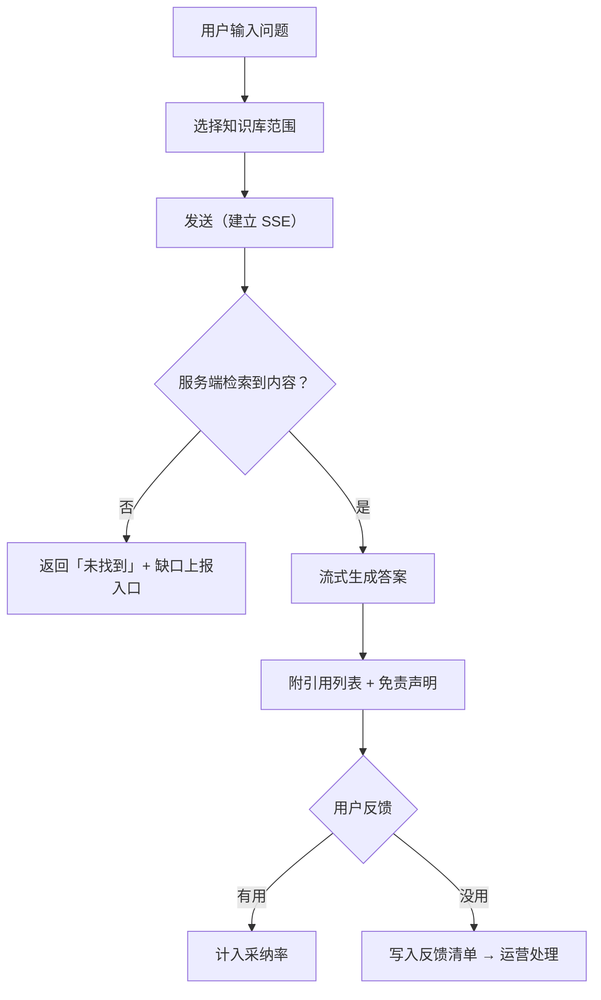

# 金融信贷知识库（RAG）产品需求文档 PRD

| 项 | 内容 |
|---|---|
| 文档版本 | v1.0 |
| 产品名称 | 信贷知识助手（Credit Knowledge Assistant） |
| 文档类型 | 产品需求文档（PRD）· 面向研发落地 |
| 目标读者 | Java 研发、测试、前端、算法、运维、合规 |
| 关联文档 | 01-架构与技术落地方案、03-数据模型与接口契约、04-工程骨架与实施路线 |
| 状态 | 待评审 |

---

## 1. 产品概述

### 1.1 背景

信贷业务的制度与产品规则高度密集且持续变化：监管文件、内部授信政策、产品说明书、操作手册分散在 OA、共享盘、邮件里。一线客户经理查一个「小微企业信用贷的最高额度与准入征信要求」，平均要在 3～5 份文档里翻找 10 分钟以上；风控与合规人员做政策比对时，口径不一致导致的返工与合规风险更难量化。

传统关键字检索解决不了三个问题：**跨文档的语义召回**、**答案的可溯源**、**回答要贴合本行口径**。

### 1.2 产品目标

| 层级 | 目标 | 衡量口径 |
|---|---|---|
| 业务目标 | 让政策与产品知识「一问即得且可溯源」 | 单次查证耗时从 10 分钟降至 ≤ 1 分钟 |
| 用户目标 | 客户经理/风控能自助拿到带原文引用的准确答案 | 答案采纳率（点赞/追问比）≥ 70% |
| 合规目标 | 所有回答可追溯、所有提问可审计 | 引用覆盖率 100%，审计记录完整率 100% |
| 建设目标 | 知识资产集中管理、更新即时生效 | 文档上线到可召回的时延 ≤ 10 分钟 |

### 1.3 产品边界（明确不做，避免范围蔓延）

| 不做 | 原因 |
|---|---|
| 不做信贷业务系统本身（进件、审批、放款） | 本产品是知识层，不是业务流程层 |
| 不做自动授信决策 | 涉及监管红线，必须人工/规则引擎 |
| 不做联网搜索 | 数据不出内网，答案必须来自行内知识库 |
| 不做通用闲聊助手 | 定位为专业工具，降低合规风险与算力浪费 |
| 首期不做多租户 | 已确认私有化单租户 |

### 1.4 产品价值主张

> 「不猜、不编、可溯源。」—— 每条答案必须能点开原文对应段落。

---

## 2. 用户与角色画像

| 角色 | 画像 | 核心诉求 | 使用频次 | 关键权限 |
|---|---|---|---|---|
| **信贷客户经理**（核心用户） | 一线业务，日均接待客户多，没耐心翻文件 | 快速拿到产品要素、准入条件、所需材料清单 | 高频（10~30 次/日） | 可访问「产品与制度」类知识库 |
| **风控专员** | 关注口径一致性、特殊情形处理 | 精准核对规则边界、例外条款 | 高频 | 可访问「风控政策」类知识库（含内部口径） |
| **合规/审计员** | 需要留痕、需要原文出处 | 检索监管文件原文、导出审计记录 | 中频 | 可访问全量知识库 + 审计后台 |
| **知识库管理员** | 承担知识资产运营 | 上传/更新/下线文档，看解析质量，看无答案问题 | 中频 | 知识库全量管理 |
| **业务产品运营** | 关注使用效果与知识缺口 | 看板、无答案 TOP 问题、反馈处理 | 低频 | 只读看板 + 反馈处理 |
| **内网业务微服务**（非人） | 授信/进件系统需要嵌入式问答 | 通过 API 获取知识增强结果 | 高频（系统调用） | 按应用维度绑定知识库 |
| **系统管理员** | 负责稳定性与安全 | 配额、限流、模型配置、审计 | 低频 | 全量后台 |

---

## 3. 业务场景（User Story）

### 场景 S1：产品要素速查（客户经理 · P0）

> 作为客户经理，我在面客时需要立刻确认「小微企业信用贷」的额度上限、期限、利率区间和所需材料，以便当场给客户答复。

- 输入：自然语言问题，可含产品名
- 期望：「答案 + 分条列出要素 + 每条要素带原文引用（文件名称 + 页码/段落）」
- 关键约束：数值类要素若来自过期文档需提示「该文档已更新，请以最新版本为准」

### 场景 S2：准入与风控口径核对（风控专员 · P0）

> 作为风控专员，我要确认「首贷户在征信查询次数上的准入口径」，以及是否存在例外情形。

- 输入：专业问法，可能含内部术语
- 期望：不仅给出结论，还要列出例外条款与适用条件
- 关键约束：涉及内部口径的知识库需按角色授权

### 场景 S3：监管文件检索与原文溯源（合规员 · P0）

> 作为合规员，我要找某条监管规定在原文中的表述，并导出出处用于汇报。

- 输入：条款关键词或条款号
- 期望：返回原文段落（不做摘要改写），一键定位到原始 PDF 对应页
- 关键约束：**必须展示原文而非 LLM 改写**，避免二次解读引入风险

### 场景 S4：知识资产管理（知识库管理员 · P0）

> 作为管理员，我要上传一批新的产品说明书，确认解析成功、分片合理，然后上线可被检索。

- 期望：批量上传、解析进度可见、分片预览可查、失败可重试、上线/下线可控

### 场景 S5：嵌入式知识增强（内网业务微服务 · P1）

> 作为进件系统的开发者，我要在客户填写资料时自动提示该产品的准入要求。

- 期望：通过 SDK（Feign）调用，返回结构化的引用与答案，支持设置超时与降级（超时则静默不展示）

### 场景 S6：效果运营与知识缺口发现（产品运营 · P1）

> 作为运营，我要知道哪些问题答不上来，据此补文档。

- 期望：无答案问题 TOP100、低采纳率问题清单、知识库覆盖率看板

---

## 4. 功能需求清单

> 优先级：**P0** 首期必做（MVP 闭环）、**P1** 首期后 1~2 个迭代、**P2** 规划中。
> 每个功能标注了对应微服务，便于研发直接派工。

### 4.1 模块 A：智能问答（rag-chat-service）

| 编号 | 功能 | 优先级 | 需求描述 | 验收要点 |
|---|---|---|---|---|
| A-01 | 单轮知识问答 | P0 | 输入问题，返回答案 + 引用列表 | 引用可点击跳转原文；无召回时不调 LLM |
| A-02 | 多轮对话 | P0 | 保留上下文，支持指代消解（「它的额度呢」） | 会话可重命名/删除；记忆窗口可配置 |
| A-03 | 流式输出 | P0 | SSE 打字机效果，首字节 ≤ 1.5s | 中途取消可中断；断连可重试 |
| A-04 | 引用溯源 | P0 | 每条答案给出「文档名 + 版本 + 位置 + 片段原文」 | 引用覆盖率 100%；点击定位原文 |
| A-05 | 空召回兜底 | P0 | 未召回到内容时明确说「未找到」并给转人工入口 | 严禁编造；兜底话术可配置 |
| A-06 | 免责声明 | P0 | 所有对外答案追加固定声明 | 文案可配置、可按知识库差异化 |
| A-07 | 知识库范围选择 | P0 | 用户可勾选本次提问检索哪些有权访问的知识库 | 默认全选有权库；不可越权 |
| A-08 | 答案反馈 | P0 | 点赞/点踩 + 文字反馈 | 反馈落库并进入运营看板 |
| A-09 | 业务工具调用（Function Calling） | P1 | 可调用只读业务接口（如产品清单、当前利率表） | 工具白名单；超时降级；调用留痕 |
| A-10 | 敏感信息脱敏 | P0 | 输出侧对身份证/卡号/手机号脱敏 | 人工构造用例必过 |
| A-11 | 追问建议 | P2 | 基于答案生成 3 条推荐追问 | 可关闭 |
| A-12 | 会话导出 | P1 | 导出为 Word/PDF，含引用 | 用于留档 |

### 4.2 模块 B：知识库管理（rag-knowledge-service）

| 编号 | 功能 | 优先级 | 需求描述 | 验收要点 |
|---|---|---|---|---|
| B-01 | 知识库 CRUD | P0 | 新建/编辑/删除知识库，配置默认分片与检索参数 | 删除需二次确认；有文档时禁止直接删除 |
| B-02 | 知识库与 RAGFlow Dataset 映射 | P0 | 创建知识库时同步创建 RAGFlow Dataset | 映射关系落库可查；失败可重试 |
| B-03 | 知识库 ACL | P0 | 按 角色/部门/用户/应用 授权访问 | 授权变更 5 分钟内生效 |
| B-04 | 目录与标签 | P1 | 文档树形目录 + 多标签 | 支持按标签批量检索范围 |
| B-05 | 密级管理 | P0 | 文档密级（公开/内部/机密）低于用户密级才可召回 | 检索结果二次过滤 |
| B-06 | 文档元数据 | P0 | 名称、类型、版本、生效日期、失效日期、来源、密级、责任人 | 生效/失效日期参与检索过滤 |
| B-07 | 版本管理 | P1 | 同一文档多版本，历史版本可回溯 | 默认只召回生效版本 |
| B-08 | 检索参数配置 | P0 | 每个知识库可配 `similarity_threshold`、`vector_similarity_weight`、`top_k`、rerank 模型 | 参数走配置中心，不发版可调 |

### 4.3 模块 C：文档入库（rag-ingest-service）

| 编号 | 功能 | 优先级 | 需求描述 | 验收要点 |
|---|---|---|---|---|
| C-01 | 单文件上传 | P0 | 支持 PDF/DOCX/XLSX/PPTX/TXT/MD/HTML/图片 | 类型白名单校验 |
| C-02 | 批量上传 | P0 | 批量选择或压缩包上传 | 单批 ≤ 200 个文件 |
| C-03 | 文件校验 | P0 | 大小（≤200MB）、类型、病毒扫描、重复检测（MD5） | 重复文件给出提示而非直接入库 |
| C-04 | 原始文档归档 | P0 | 落 MinIO 永久保存，供溯源下载 | 对象路径规则化、可审计 |
| C-05 | 上传并解析 | P0 | 上传 RAGFlow 并触发解析 | 解析失败有明确错误原因 |
| C-06 | 解析状态跟踪 | P0 | 状态机：PENDING/UPLOADED/PARSING/PARSED/FAILED/OFFLINE | 状态实时可见；超时判失败 |
| C-07 | 失败重试 | P0 | 手动重试，最多 3 次 | 重试记录可查 |
| C-08 | 分片预览与调整 | P1 | 查看分片结果，可手动编辑分片 | 编辑后触发重新向量化 |
| C-09 | 解析质量报告 | P1 | 表格/图片识别率、空分片占比、异常分片提示 | 低质量文档给出告警 |
| C-10 | 文档下线 | P0 | 下线后不可被召回 | 下线即时生效 |

### 4.4 模块 D：检索服务（rag-retrieval-service）

| 编号 | 功能 | 优先级 | 需求描述 | 验收要点 |
|---|---|---|---|---|
| D-01 | 混合检索 | P0 | 向量 + 关键词混合，参数可配 | 透传 RAGFlow 参数 |
| D-02 | Query 改写 | P0 | 口语化问题 → 检索友好查询（含同义扩展、术语归一） | 改写前后可对比日志 |
| D-03 | Rerank 精排 | P0 | 对 TopN 做二次精排 | 精排耗时 P95 ≤ 100ms |
| D-04 | 业务过滤 | P0 | 按知识库授权、密级、生效日期、机构/产品维度过滤 | 越权内容零泄漏 |
| D-05 | 结果去重 | P1 | 相似片段合并，避免重复引用 | 重复率 ≤ 5% |
| D-06 | 检索缓存 | P1 | 同 query + 同权限指纹 + 同知识库版本命中缓存 | 缓存 Key 必须含权限指纹 |
| D-07 | 纯检索接口（无生成） | P1 | 供检索页、内网系统使用 | 返回结构化 chunks |
| D-08 | 召回评测 | P1 | 维护评测集，测量 Top5 命中率 | 支持一键跑评测出报告 |

### 4.5 模块 E：平台治理（rag-platform-service）

| 编号 | 功能 | 优先级 | 需求描述 | 验收要点 |
|---|---|---|---|---|
| E-01 | 用户/角色/部门 | P0 | 用户与组织管理，支持对接统一身份源 | 支持 OIDC/CAS 令牌转换 |
| E-02 | 登录与令牌 | P0 | 签发/校验 JWT，支持刷新与注销 | 令牌有效期可配 |
| E-03 | 应用凭证管理 | P0 | 内网应用 AppKey/AppSecret 发放、轮换、禁用 | 支持一应用多密钥并行轮换 |
| E-04 | 请求签名校验 | P0 | AppKey + HMAC-SHA256 签名校验 + 时间戳防重放 | 时间偏差 > 5 分钟拒绝 |
| E-05 | 配额与限流规则 | P0 | 按用户/应用配置 QPS 与日调用量 | 触发限流返回 429 且可追溯 |
| E-06 | 审计日志 | P0 | 记录提问、检索、入库、配置变更全量操作 | 留存可配；支持按人/时间/知识库检索 |
| E-07 | 模型配置 | P0 | 配置模型提供商、模型名、温度、最大 token、敏感度路由规则 | 支持热更新 |
| E-08 | 敏感信息规则库 | P0 | 脱敏正则与词典可维护 | 变更即时生效 |
| E-09 | 运营看板数据 | P1 | 提问量、活跃用户、采纳率、空召回率、Token 消耗 | 支持按日/周/月 |
| E-10 | 反馈工单闭环 | P2 | 点踩问题转知识库待办 | 支持状态流转 |

### 4.6 优先级的排期含义

| 优先级 | 含义 | 目标交付 |
|---|---|---|
| P0 | MVP 闭环，缺一不可 | Sprint 1~3（约 6 周） |
| P1 | 体验与运营增强 | Sprint 4~5（约 4 周） |
| P2 | 规划中，需求池 | 后续按需 |

---

## 5. 页面结构与交互

### 5.1 页面清单

| 页面 | 路径 | 主要功能 | 使用角色 | 优先级 |
|---|---|---|---|---|
| 智能问答 | `/chat` | 对话、引用卡片、知识库范围选择、反馈 | 全部业务角色 | P0 |
| 检索工作台 | `/search` | 纯检索、片段浏览、原文定位、筛选 | 风控/合规 | P1 |
| 知识库列表 | `/kb` | 知识库 CRUD、ACL 配置、检索参数 | 管理员 | P0 |
| 文档管理 | `/kb/:id/docs` | 上传、状态跟踪、版本、下线、分片预览 | 管理员 | P0 |
| 检索评测 | `/eval` | 评测集管理、一键评测、报告 | 管理员/算法 | P1 |
| 运营看板 | `/dashboard` | 核心指标、无答案 TOP、反馈清单 | 运营 | P1 |
| 系统设置 | `/settings` | 用户/角色、应用凭证、模型配置、脱敏规则 | 管理员 | P0 |
| 审计日志 | `/audit` | 查询与导出 | 合规/管理员 | P0 |

### 5.2 智能问答页关键交互

```
┌──────────────────────────────────────────────┬────────────────────┐
│  智能问答                                     │  引用来源           │
│                                               │  ┌──────────────┐  │
│  我：小微企业信用贷的最高额度是多少？           │  │1 产品说明书v3 │  │
│                                               │  │  P12 第3段    │  │
│  AI：根据《XX产品说明书 v3.2》，最高额度为      │  │  原文片段…    │  │
│      ¥500 万元 [1]，需同时满足以下准入条件：    │  └──────────────┘  │
│      · 征信近 12 个月查询 ≤ 6 次 [1]           │  ┌──────────────┐  │
│      · 经营年限 ≥ 2 年 [2]                     │  │2 2024年授信政策│  │
│                                               │  │  P8 第2段     │  │
│      ⚠ 以上内容仅供参考，请以行内正式制度为准    │  └──────────────┘  │
│                                               │                    │
│  👍 有用  👎 没用   [追问建议]  [导出]          │  [查看原文]         │
├──────────────────────────────────────────────┴────────────────────┤
│ 知识库范围：[✓]产品与制度  [✓]风控政策  [ ]内部口径（无权限，灰显）   │
│ 输入框…                                            [发送]           │
└───────────────────────────────────────────────────────────────────┘
```

**交互要点**

1. **引用与正文双向高亮**：鼠标悬停 `[1]` 时右侧对应卡片高亮；点击卡片「查看原文」在原文 PDF 对应页打开。
2. **无权限的知识库可见但灰显**，不可勾选，点击提示「无访问权限，请联系管理员」——可发现优于不可见，避免用户误以为系统没收录。
3. **无召回时的界面**必须是「未找到相关内容」+ 「换个问法」建议 + 「提交知识缺口」按钮，**绝不展示 LLM 自由发挥的内容**。
4. **流式过程中禁用发送**，但允许「停止生成」。
5. 答案右上角常驻「复制」「导出」「反馈」。

---

## 6. 核心流程

### 6.1 问答主流程（用户视角）



### 6.2 知识库建设流程（管理员视角）

```
收集材料 → 上传 → 解析质检 → 分片校验 → 配置ACL与密级 → 上线 → 运营观察（无答案TOP）→ 补充/修订文档
```

关键卡点：**「分片校验」不可跳过**。信贷文档的利率表、额度表若被切碎，检索会召回半截表格，导致答案错误——这是同类项目最高频的线上事故。

### 6.3 知识库更新生效流程

```
新版本上传 → 解析成功 → 旧版本自动置为「历史」→ 检索只召回生效版本
                                          → 检索缓存按 dataset 版本号失效
```
目标：**从上传完成到可召回 ≤ 10 分钟**（含缓存失效）。

---

## 7. 数据与埋点指标

### 7.1 核心指标定义

| 指标 | 定义 | 目标 | 数据来源 |
|---|---|---|---|
| 日提问量 | 每日成功问答次数 | 观测 | `t_message` |
| 活跃提问用户 | 当日在问答页提问的去重用户 | 观测 | `t_message` + `t_conversation` |
| 答案采纳率 | 点赞数 /（点赞+点踩） | ≥ 70% | `t_feedback` |
| 引用覆盖率 | 含引用的答案数 / 总答案数 | 100% | `t_message_citation` |
| 空召回率 | 无召回次数 / 总提问次数 | ≤ 15% | `t_retrieval_log` |
| 首字节时间 TTFB | 从发请求到首个 token | P95 ≤ 1.5s | 埋点 |
| 端到端耗时 | 完整答案耗时 | P95 ≤ 8s | 埋点 |
| 知识库覆盖率 | 被提问过的文档数 / 已上线文档数 | ≥ 60% | `t_message_citation` |
| Token 消耗 | 输入/输出 token 总量 | 成本监控 | `t_token_usage` |
| 转人工率 | 触发转人工的次数 / 空召回次数 | 观测 | 埋点 |

### 7.2 埋点事件清单

| 事件 | 触发时机 | 关键属性 |
|---|---|---|
| `chat_request` | 用户发送问题 | userId、conversationId、kbScope、questionLen |
| `retrieval_result` | 检索返回 | query、datasetId、chunkCount、topScore、costMs、cacheHit |
| `llm_response` | 生成完成 | model、inputTokens、outputTokens、costMs、ttfbMs |
| `answer_guardrail_hit` | 护栏命中 | 类型（空召回/无引用/敏感信息/越权）、questionId |
| `user_feedback` | 用户评价 | messageId、type（like/dislike）、reason |
| `doc_ingest_state` | 入库状态流转 | docId、fromState、toState、costMs、errorMsg |
| `kb_acl_change` | ACL 变更 | kbId、operator、before、after |

---

## 8. 非功能需求

| 类别 | 要求 |
|---|---|
| 性能 | 见 01 文档 §9；首字节 P95 ≤ 1.5s，检索 P95 ≤ 400ms |
| 可用性 | 99.9%；`rag-platform-service` 与网关多实例 |
| 并发 | 在线问答 ≥ 200 并发会话；批量上传与在线问答资源隔离 |
| 安全 | 见 01 文档 §8 全量清单 |
| 兼容 | Chrome/Edge 最新两个大版本；支持 1280px 及以上分辨率 |
| 数据保留 | 会话 12 个月、审计 ≥ 6 个月、原始文档永久 |
| 可维护 | 检索参数、Prompt 模板、脱敏规则、模型配置全部热更新，不发版 |
| 国际化 | 首期仅简体中文 |

---

## 9. 验收标准（可直接转测试用例）

### 9.1 功能验收

| # | 用例 | 步骤 | 预期 |
|---|---|---|---|
| V1 | 基础问答 | 提问产品额度 | 返回答案且含 ≥1 条引用，引用可定位原文 |
| V2 | 无召回 | 提问知识库完全没有的问题（如「今天天气」） | 返回「未找到相关内容」，**不调用 LLM**，有转人工入口 |
| V3 | 越权召回 | 用客户经理账号提问只有风控库才有的内容 | 不返回该内容；若引用越权文档则整条拦截 |
| V4 | 伪造来源 | 内网调用方手动加 `X-Request-Source: DMZ_GATEWAY` | 返回 403 |
| V5 | 应用签名过期 | AppKey 签名时间戳偏差 10 分钟 | 返回 401 |
| V6 | 限流 | 同一 AppId 超过配额 QPS | 返回 429，且审计可见 |
| V7 | 流式中断 | 生成中点击停止 | 已生成内容保留，会话可继续 |
| V8 | 敏感信息 | 让模型复述含手机号的片段 | 输出中手机号被脱敏 |
| V9 | 解析状态 | 上传 200 页 PDF | 状态从 PENDING→PARSED，≤ 10 分钟；可提问 |
| V10 | 解析失败重试 | 上传损坏文件 | 状态 FAILED，错误原因明确，可重试 ≤3 次 |
| V11 | 文档下线 | 下线某文档后提问其独有内容 | 不再召回 |
| V12 | 缓存越权 | A 用户检索后，B 用户（权限不同）问同问题 | B 不命中 A 的缓存，结果按 B 权限返回 |
| V13 | 引用完整性 | 任意答案 | 正文 `[n]` 与引用列表条目一一对应 |
| V14 | 审计完整 | 任意问答后查审计 | 有完整记录（人、时、问、召回文档） |

### 9.2 非功能验收

| # | 项 | 标准 |
|---|---|---|
| N1 | 首字节 | 200 并发下 P95 ≤ 1.5s |
| N2 | 检索耗时 | 100 QPS 压测下 P95 ≤ 400ms |
| N3 | SSE 稳定性 | 连续 30 分钟长连接不断流、不缓冲 |
| N4 | 网关不可用 | platform 宕机时，网关仍能拒绝非法请求（fail-close） |
| N5 | 模型故障 | 主模型不可用时自动切换备用模型，失败率 < 5% |

---

## 10. 里程碑

| 阶段 | 内容 | 交付物 | 依赖 |
|---|---|---|---|
| M0 准备 | 环境搭建（Nacos/MySQL/Redis/MinIO/RocketMQ/RAGFlow）、版本锁定、评测集种子 | 环境可用 + 冒烟通过 | 运维/硬件到位 |
| M1 骨架 | 6 服务骨架 + rag-common/rag-api + 网关鉴权打通 | 空跑链路通（鉴权→路由→返回） | M0 |
| M2 知识资产 | 知识库/文档/ACL/入库流水线 + RAGFlow 对接 | 能上传文档并解析成功 | M1 |
| M3 检索 | 检索服务 + 参数配置 + 评测集跑通 | Top5 命中率基线达成 | M2 |
| M4 问答 | 问答编排 + SSE + 引用 + 护栏 | 问答闭环可用 | M3 |
| M5 治理 | 配额限流、审计日志、看板、脱敏规则 | P0 全量验收通过 | M4 |
| M6 试运行 | 灰度 20 人试用、调参、补文档 | 采纳率 ≥ 70% | M5 |
| M7 全量 | 全员开放 + 运营机制 | 上线 | M6 |

---

## 11. 附录

### 11.1 术语表

| 术语 | 说明 |
|---|---|
| RAG | 检索增强生成，先检索知识库再让大模型基于检索结果作答 |
| Dataset | RAGFlow 中的知识库实体，与本文档的「知识库」一一映射 |
| Chunk | 文档切分后的片段，是检索与引用的最小单位 |
| Rerank | 对初步召回结果做二次精排，提升相关性 |
| 空召回 | 检索结果的相关度低于阈值，等价于「没找到」 |
| ACL | 访问控制列表，定义谁能访问哪个知识库 |
| TTFB | Time To First Byte，首字节时间 |
| AppKey/AppSecret | 内网应用身份凭证，用于服务间鉴权 |
| DMZ | 隔离区，内外网之间的缓冲区 |
| SF 内网 | 可信内网区，AI 服务与知识库所在区 |

### 11.2 需求池（P2 及以后）

- 答案多模态展示（图表还原、表格结构化渲染）
- 基于回答自动生成信贷话术/客户沟通模板
- 知识库健康度评分与自动巡检
- 多轮任务型 Agent（查知识 → 查业务系统 → 生成清单）
- 语音提问
- 移动端（企业微信/钉钉）接入
- 答案与制度文件版本变更的自动影响分析

### 11.3 风险登记（产品视角）

| 风险 | 影响 | 应对 |
|---|---|---|
| 文档解析质量不达标（表格/影印件） | 答案错误，用户信任崩塌 | 分片校验卡点 + 表格类文档专项优化 + 人工校对关键文档 |
| 用户期望过高，把工具当决策依据 | 合规风险 | 免责声明 + 明确「仅供参考」+ 培训 |
| 知识库更新滞后 | 答案过期 | 责任人机制 + 文档生效日期字段 + 过期文档告警 |
| 采纳率低导致弃用 | 项目失败 | 试运行期高频收集反馈，优先补齐无答案 TOP 问题 |
