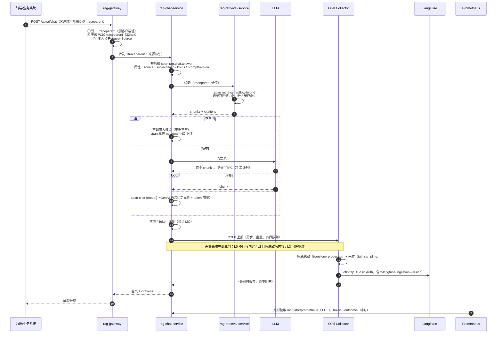

# AI 可观测性与运维监控方案（RAG 知识库平台）

| 项 | 内容 |
|---|---|
| 文档版本 | v1.0 |
| 编制角色 | 企业级 Agent 平台架构师 |
| 目标读者 | Java 研发团队、SRE/运维、安全合规、产品经理 |
| 上游输入 | 附件《大模型监控》（豆包生成，`jiankong-1.txt`）＋ 本工程 01/02/03/04 文档与代码骨架 |
| 关联文档 | 01-架构与技术落地方案、02-PRD、03-数据模型与接口契约、04-工程骨架与实施路线 |
| 结论一句话 | **附件的大方向正确，但有 5 处会直接导致落地失败的硬伤；LangFuse 要用，但它只是「AI 业务可观测与评估层」，不是监控的全部，更不是控制面。** |

---

## 0. 结论摘要（TL;DR）

### 0.1 对附件的判断

| 判断 | 内容 |
|---|---|
| **总体结论** | ✅ **「OTel 统一埋点 + LangFuse（AI 业务链路）+ Prometheus/Grafana（基础设施指标）」这个三层组合是正确的行业主流做法**，可以直接采纳为骨架。 |
| **但有 5 处硬伤** | ① traceId 不是 W3C 格式 → 链路关联必然失败；② 「Collector 转发 Metrics 给 Prometheus」不符合 Prometheus 的 pull 模型；③ 「OTel Java Agent 自动埋点」在本技术栈不成立，且 LangChain4j 的埋点路径描述有误；④ TTFT 无法由监听器自动获得，必须手写，附件漏了这个前提；⑤ LangFuse v3 自托管缺对象存储（MinIO/S3）这一必需组件。详见 §1.2。 |
| **还缺 6 项必补内容** | 控制面（限流/配额/熔断/缓存/内容安全）、评估数据集与回归门禁、成本归因三方对齐、采样策略、多环境隔离、容量与数据生命周期。详见 §1.3。 |
| **采用哪个方案** | 采用**附件方案的三层骨架并做修正**，命名为「**L0 控制面 + L1 指标 + L2 链路 + L3 AI 业务观测与评估 + L4 日志 + L5 合规**」六层；落地按 §11 的**四阶段**推进（比附件的三阶段多一个「埋点规范化」前置阶段）。 |

### 0.2 三条必须记住的边界

1. **LangFuse 不做基础设施监控、不做熔断限流、不是告警中心**。它负责回答「这次回答为什么不对」；Prometheus/Grafana 负责回答「系统是不是快挂了」；控制面负责「不让它挂」。
2. **可观测不能反向影响业务**。上报失败只允许丢数据，绝不允许阻塞、重试拖慢或抛异常到主链路（本方案用「异步队列 + 有界缓冲 + 超限丢弃 + 超时熔断」四件套保证）。
3. **金融场景的可观测本身是数据出境风险**。问答原文、召回片段、用户身份都是敏感数据；本方案默认**不落全文**，只落结构化指标与指纹，内容采集按需临时开启（§6）。

---

## 1. 附件方案评审（逐条）

### 1.1 判定图例

- ✅ **正确**：可直接采纳
- ⚠️ **半对**：方向对、细节或前提错，照抄会踩坑
- ❌ **错误**：按原文实现会失败

### 1.2 逐条勘误表（15 条）

| # | 附件原文（摘要） | 判定 | 事实与修正 |
|---|---|---|---|
| 1 | 结论：LangFuse 适合本架构，是「LLM 专属可观测平台」，不替代 APM | ✅ | 与业界主流一致。定位划分正确，这是全文最有价值的一句。 |
| 2 | 优先内网自托管 LangFuse，不上云 | ✅ 必须 | 金融合规硬约束。**但附件写「Postgres+Redis+ClickHouse」三件套不完整**：LangFuse v3 起共 6 个容器 —— `langfuse-web`、`langfuse-worker`、PostgreSQL（元数据）、ClickHouse（Trace 分析）、Redis（队列/缓存）、**MinIO/S3（事件与多媒体对象存储，必需）**。缺少对象存储会在启动阶段就报错。资源基线：≥ 4 vCPU / 8~16 GB RAM / 100 GB 起盘。 |
| 3 | 「LangChain4j 通过 OTel 埋点上报 Trace，不绑定 SDK」 | ⚠️ | 方向对、**路径错**。LangChain4j 不会直接产出 OTel span。真实链路是：<br/>`LangChain4j ChatModelListener（事件含 GenAI 语义约定属性）→ Micrometer Observation/Metrics（langchain4j-micrometer-* 模块）→ Micrometer Tracing 的 OTel Bridge → OTLP → Collector → LangFuse`。<br/>另外：LangChain4j **不对 Agent 编排、检索、业务步骤做任何自动埋点**，这些 span 必须自己写。 |
| 4 | 「OTel Collector 异步批量转发：Trace 给 LangFuse，Metrics 给 Prometheus」 | ❌ | 两处都不严谨：<br/>① **Prometheus 是 pull 模型**，不存在「Collector push 给 Prometheus」的标准数据流。正确做法二选一：Collector 用 `prometheus` exporter 暴露 `/metrics` 端点供 Prometheus 定时抓取；或 Collector 用 `prometheusremotewrite` exporter 推到 Prometheus 的 remote-write 接收端（需开启该能力）。**最简做法是根本不让 Collector 管指标** —— 各服务已经暴露 `/actuator/prometheus`，Prometheus 直接抓。<br/>② LangFuse 的 OTLP 端点不是「配个 URL 就行」：`/api/public/otel/v1/traces` 需要 **HTTP Basic Auth（publicKey 作用户名、secretKey 作密码）**，且需自定义头 `x-langfuse-ingestion-version: 4`，Collector 侧要在 `otlphttp` exporter 上配 `headers`。 |
| 5 | 「埋点在 AI-Service 内部完成，LangFuse 挂掉不影响业务」 | ✅ | 正确。落地手段：应用侧 OTLP exporter 用批量 + 有界队列；Collector 侧 `memory_limiter` + `sending_queue` + 重试上限 + `retry_on_failure`，超限即丢；链路全异步。 |
| 6 | Span 树：`ai_service_chat` / `query_rewrite` / `rag_retrieval` / `llm_invoke` | ⚠️ | 层级合理，**命名不合规范**。OTel GenAI 语义约定要求：<br/>• 模型调用：`{gen_ai.operation.name} {gen_ai.request.model}` → 例如 `chat deepseek-chat`<br/>• 检索：`retrieval {xxx}`（v1.40 新增 Retrieval span）<br/>• 工具调用：`execute_tool {tool.name}`（v1.41 起必须带工具名）<br/>• Agent：`invoke_agent {gen_ai.agent.name}` / `create_agent {name}`<br/>• 业务根 span：用**自己的业务名 + 自有前缀**（如 `rag.chat.answer`），不要伪装成规范名。<br/>用错名字的代价是 LangFuse 无法按「类型」聚合与统计，大屏要重做。 |
| 7 | 「llm_invoke 记录 TTFT」「TTFT 属自定义 Metrics」 | ⚠️ | OTel 在 **v1.41.0（2026-04）已定义流式指标** `gen_ai.client.operation.time_to_first_chunk` 与 `.time_per_output_chunk`，应优先用规范名。<br/>**关键前提附件没写**：LangChain4j 的 `ChatModelListener` 目前**拿不到逐 chunk 事件**（官方 issue #6471 明确「按流式 chunk 记录 TTFT 在当前监听器 API 下不可行」），因此 **TTFT 必须在我们自己的 SSE 回调里手工计时**。附件说「自定义 Metrics」是对的，但没说「必须手写」，照抄会卡住。 |
| 8 | 「OpenTelemetry Java Agent 埋点（自动）」 | ❌ | ① Java Agent 的自动埋点覆盖 HTTP 客户端/服务端、JDBC、Redis、MQ 等通用组件，**对 LangChain4j 没有自动能力**；② 本栈是 Spring Boot 3 + Micrometer Tracing，应走「**依赖式** OTLP 导出」（`micrometer-tracing-bridge-otel` + `opentelemetry-exporter-otlp`），比 agent 更可控、随镜像交付、不需要额外 JVM 启动参数与容器权限；③ 生产环境用 `-javaagent` 还要过一遍安全基线审查，没必要。 |
| 9 | 「SkyWalking（可选）」 | ⚠️ | 若同时上 SkyWalking + OTel 两套追踪，等于维护两套 trace 上下文（traceId 不同源）与两套存储，排障时两边对不上。**建议追踪只用 OTel 一套**：全量 trace 进 Tempo（或 Jaeger），LLM 语义部分进 LangFuse；确有 SkyWalking 存量时，用 Collector 的 `skywalking` exporter 转发，而**不是让应用双埋点**。 |
| 10 | 「网关生成 TraceId，Header 一路透传，整条链路统一」 | ❌ | 结论对，**现有代码有硬伤**：骨架 `TraceIds.newTraceId()` 生成的是 `r` + UUID 的 **37 位、含非十六进制前缀** 的字符串，**不符合 W3C Trace Context 的 trace-id 规范（32 位小写十六进制）**，OTel/Collector/LangFuse 无法接受，跨系统关联一定失败。<br/>修正三件事：① 生成 32 位小写 hex；② 用标准 `traceparent` 头透传（而非自定义 `X-Trace-Id`）；③ **把 `traceparent` 加入网关必须洗白的头部黑名单** —— 客户端能伪造它，伪造后可以污染/覆盖整条链路（本次已落地）。 |
| 11 | 「上报 LangFuse 前脱敏」「支持开关不上传原始 prompt/answer」 | ✅ 需强化 | 补三点：<br/>① 脱敏必须做在**应用侧 SDK 边界**（代码 + 单测），Collector 的 `transform/redaction` processor 只作兜底 ——「处理器删掉了不该采集的字段」是安全网，不是控制手段；<br/>② 内容采集用 OTel 规范的 opt-in 属性（`gen_ai.system_instructions` / `gen_ai.input.messages` / `gen_ai.output.messages`）或独立事件 `gen_ai.client.inference.operation.details`，这样内容与 trace **分离设置保留期与访问权限**；<br/>③ 金融信贷建议**默认不落全文**，只落结构化指标 + 内容指纹（SHA-256 前 16 位），需要排查时按 `traceId` 临时开启抓取。 |
| 12 | 「LangFuse 后台做 RBAC」 | ⚠️ | 自托管开源版是「组织 / 项目 / 成员角色」的**粗粒度**模型；细粒度 RBAC 与 SSO/SCIM 属企业版能力。落地前须确认版本能力，否则用替代方案：**知识库 → LangFuse project 一多映射 + 网络层限制（只允许内网特定网段访问 LangFuse UI）**。 |
| 13 | 「LangFuse 不做告警，告警统一放 Prometheus/AlertManager」 | ✅ 可采纳 | 结论可用，但表述过绝对（LangFuse 有基础告警与 webhook，只是维度少、能力弱）。工程上确实建议告警统一收敛到 Alertmanager，**并额外把质量类告警**（空召回率、幻觉率、采纳率跌破基线）纳入同一告警通道 —— 否则「系统一切正常，但答案质量悄悄劣化」没人管。 |
| 14 | 「异步上报，SSE 流式场景也支持」 | ✅ | 正确。需补一句口径提醒：流式下 span 的结束时间是「最后一个 chunk」，因此 **「用户感知首字延迟」≠「span duration」**，看板必须分别统计，否则会得出错误结论。 |
| 15 | 三阶段路线：先 Prometheus → 再 LangFuse → 再评估 | ⚠️ | 顺序建议调整：把「**埋点规范化**（GenAI 指标名 + traceId 改造 + 采集策略）」提到第一阶段。理由：它要改代码、要发版；放到第二阶段会返工，且第一阶段的 Grafana 大屏会因为指标改名而重做。修正后的路线见 §11。 |

### 1.3 附件没覆盖、但必须补的 6 项

| # | 缺口 | 为什么必须补 | 本方案落点 |
|---|---|---|---|
| 1 | **控制面**（不是观测，是控制） | 你问的是「监控**和控制**」。附件通篇只讲观测：模型路由与熔断、Token 级配额、语义缓存、Prompt 版本灰度、内容安全都需要落点 | §4（L0 控制面）、§4.3（模型出口网关选型） |
| 2 | **评估数据集与回归门禁** | 没有基线就无法判断「这次改动让效果变好还是变坏」；信贷知识库必须能证明效果不退化 | §8 |
| 3 | **成本归因三方对齐** | Token 消耗要能按「部门 / 应用 / 知识库 / 模型」归因，且本地库（`t_token_usage`）、Prometheus label、LangFuse metadata 三处的口径必须一致，否则财务对不上账 | §7.3 |
| 4 | **采样策略** | 100% 采样在生产会打爆 ClickHouse 与网络；但错误样本又不能丢 | §7.2 |
| 5 | **多环境隔离** | dev/staging/prod 混在一个 project 里，压测数据会污染真实质量指标 | §10.4 |
| 6 | **容量与数据生命周期** | ClickHouse 无 TTL 会无限膨胀；合规要求保留期可配 | §7.4、§10.5 |

---

## 2. 选型结论

### 2.1 LangFuse 要用吗？—— 用，但看清它是什么

| 问题 | 结论 |
|---|---|
| 要不要用 LangFuse？ | **要**。它是目前唯一同时满足「开源可完全私有化 + OTel 原生 + 支持 LangChain4j 所在的 Java 生态 + 自带 LLM-as-judge 评估与人工标注 + Prompt 版本管理」的平台。 |
| 它能替代 APM 吗？ | **不能**。不采集 JVM/容器/DB 指标，不做限流熔断，告警能力弱。 |
| 它能替代日志平台吗？ | **不能**。它是「Trace + 评估 + Prompt」平台，不是日志检索。 |
| 必须要它吗？ | **不是必须**。若团队只有 3 人、且首期只要「能报警 + 能查慢」，`Prometheus + Grafana + Loki` 单独就够（§11 第一阶段）。LangFuse 的价值在「质量与效果治理」，那是第二期的事。 |
| 最大代价是什么？ | **多一套 6 容器的有状态集群**（Postgres + ClickHouse + Redis + MinIO + web + worker），以及**多一份敏感问答数据的落盘面**。对一个 5~10 人团队，这是实打实的运维负担与合规评审成本 —— 必须提前认领。 |

### 2.2 备选平台对比（2026-09 核对）

| 平台 | 私有化 | Java/LangChain4j 友好度 | LLM 评估 | Prompt 管理 | 告警 | 运维成本 | 结论 |
|---|---|---|---|---|---|---|---|
| **LangFuse（自托管 v3/v4）** | ✅ 完全 | ✅ OTel 接入，语言无关 | ✅ 人工标注 + LLM-as-judge + 数据集 | ✅ | ⚠️ 弱 | 高（6 容器） | **推荐（第二期起）** |
| LangSmith | ❌ 私有化昂贵 | ❌ Python/LangChain 优先 | ✅ | ✅ | ⚠️ | 低（云） | 不推荐（数据出境 + Java 弱） |
| Arize Phoenix | ✅ | ⚠️ OpenInference 为主 | ✅ | ❌ | ❌ | 中 | 备选。**注意：2026-08 Dynatrace 已签约收购 Arize**，路线存在不确定性，金融场景不宜押注 |
| OpenObserve / SigNoz | ✅ | ✅ OTel 原生 | ❌ 弱 | ❌ | ✅ 较好 | 中 | 备选：想「一套平台同时看微服务链路 + LLM trace」时可考虑，但评估与 Prompt 能力弱 |
| Grafana LGTM（Loki+Grafana+Tempo+Mimir） | ✅ | ✅ OTel 原生 | ❌ | ❌ | ✅ | 中 | **推荐作为 L1/L2/L4 底座**（指标/链路/日志），与 LangFuse 互补而非竞争 |
| Langtrace / Helicone | ⚠️ | ⚠️ | ⚠️ | ⚠️ | ⚠️ | 中 | 不推荐（生态与合规成熟度不足） |

> **诚实说明**：LangFuse 的替代品不是没有，而是「同等能力 + 可完全私有化 + 支持 Java」这三条同时满足的很少。如果贵行的安全评审不接受 ClickHouse 里存在问答文本，那正确答案不是换平台，而是**把内容采集关掉**（§6 的 L2 档）—— 此时 LangFuse 退化为「结构化 LLM 指标 + 评估平台」，仍然有价值。

### 2.3 最终栈（六层）

| 层 | 名称 | 组件 | 回答什么问题 | 引入阶段 |
|---|---|---|---|---|
| **L0** | **控制面**（非可观测） | SCG 网关限流（已有）、Sentinel、`LlmRouter`（已有）、护栏 `AnswerGuardrail`（已有）、**可选**模型出口网关（Higress/LiteLLM） | 「不让它挂 / 不让它跑飞 / 不让它说出不该说的」 | 一期（已有）+ 二期补 Sentinel |
| **L1** | 基础设施与服务指标 | Micrometer + Actuator + **Prometheus + Grafana + Alertmanager** | 「系统是不是快挂了」 | **一期（最先）** |
| **L2** | 链路追踪 | **Micrometer Tracing（OTel Bridge）+ OTLP + OTel Collector**；全量 trace 出口到 Tempo（二期可选，一期可只出 LangFuse） | 「这次请求慢在哪一跳」 | 一期 |
| **L3** | AI 业务观测与评估 | **LangFuse**（Trace 回放 / Token 成本 / 人工标注 / LLM-as-judge / 数据集 / Prompt 版本） | 「这次回答为什么不对」 | **二期** |
| **L4** | 日志 | Logback JSON + **Loki**（或 ELK） | 「当时到底发生了什么」 | 一期（可复用行内现有 ELK） |
| **L5** | 合规与内容安全 | 审计台账（`t_audit_log`，已有）+ 脱敏（`AnswerGuardrail`，已有）+ 评估留档（`t_llm_eval_score`，本期新增） | 「能不能过监管检查」 | 一期起持续 |

**为什么把控制面单列一层**：观测是「事后知道」，控制是「事中拦住」。Token 成本失控、模型跑飞、Prompt 注入这三类问题，靠事后看板是救不回来的，必须有事中闸门。好消息是这三件事在你现有骨架里**已经有了**（网关限流 + LlmRouter 密级路由 + 护栏），本期只需把它们接入统一的指标与告警。

---

## 3. 目标架构布局

### 3.1 全景（在原架构上叠加可观测与控制）

```mermaid
flowchart TB
    subgraph EXT["外部 / 办公网"]
        WEB["Web 前端"]
        BIZ["内网业务微服务"]
    end

    subgraph DMZ["DMZ 区"]
        NGX["Nginx / TLS"]
        GW["rag-gateway<br/>鉴权 · 限流 · traceparent 洗白与生成"]
    end

    subgraph SF["SF 内网应用区"]
        CHAT["rag-chat-service<br/>LangChain4j 编排"]
        RET["rag-retrieval-service"]
        KNW["rag-knowledge-service"]
        ING["rag-ingest-service"]
        PLT["rag-platform-service"]
        RF["RAGFlow"]
        LLM["LLM 服务<br/>DeepSeek / 通义 / vLLM"]
    end

    subgraph OBS["可观测区（SF 内网独立网段，不对外暴露）"]
        COT["OTel Collector × 2<br/>接收 · 脱敏 · 采样 · 扇出"]
        LF["LangFuse v3<br/>web + worker + PG + ClickHouse + Redis + MinIO"]
        PROM["Prometheus"]
        AM["Alertmanager"]
        GRAF["Grafana"]
        TEMPO["Tempo（二期，可选）<br/>全量 trace 检索"]
        LOKI["Loki"]
    end

    WEB --> NGX --> GW --> CHAT
    GW --> KNW
    GW --> PLT
    BIZ -. "Feign 直连 + AppKey 签名" .-> CHAT
    BIZ -. "Feign 直连" .-> RET

    CHAT --> RET --> RF
    CHAT --> LLM
    KNW --> RF
    ING --> RF
    CHAT --> PLT
    RET --> PLT

    CHAT -- "OTLP/HTTP<br/>traces + metrics" --> COT
    RET --> COT
    GW --> COT
    PLT --> COT
    KNW --> COT
    ING --> COT

    COT -- "otlphttp（Basic Auth）" --> LF
    COT -. "全量 trace（二期）" .-> TEMPO
    COT -. "日志（可选）" .-> LOKI

    PROM -- "拉取 /actuator/prometheus" --> CHAT
    PROM -- "拉取" --> RET
    PROM -- "拉取" --> GW
    PROM -- "拉取" --> PLT
    PROM --> AM --> GRAF
    PROM --> GRAF
    LF -. "质量类告警 webhook" .-> AM
    TEMPO --> GRAF
    LOKI --> GRAF

    subgraph CTRL["L0 控制面（虚线为事中拦截，非数据流）"]
        RL["网关限流 / Sentinel"]
        ROUTER["LlmRouter 密级路由 + 熔断"]
        GUARD["AnswerGuardrail 护栏"]
    end
    GW -.-> RL
    CHAT -.-> ROUTER
    CHAT -.-> GUARD
```



**读图四个要点**

1. **可观测区独立成网段**，只接受内网应用区主动上报；它自己**不对外暴露任何端口**（LangFuse UI 走内网 SSO/堡垒机）。这条是金融场景的硬要求。
2. **指标与链路走两条路**：指标由 Prometheus **拉** 各服务 `/actuator/prometheus`；链路由各服务 **推** 到 OTel Collector。附件把两者混成「Collector 统一分发」，是实现层面最常见的错误来源（§1.2 第 4 条）。
3. **Collector 是唯一出口**。应用只认 `OTEL_EXPORTER_OTLP_ENDPOINT`，不认 LangFuse。好处：换后端、加出口、改采样、加脱敏都只改 Collector 配置，**不用重新发版**。
4. **控制面是虚线**，代表「事中拦截」发生在请求路径上，与数据面（上报）完全解耦 —— 可观测区挂掉不影响拦截，反之亦然。

### 3.2 数据流（含脱敏与采样落点）



### 3.3 网络访问矩阵（可观测部分）

| 源 → 目标 | 端口 | 是否放通 | 备注 |
|---|---|---|---|
| 各服务 → OTel Collector | 4318（OTLP/HTTP） | ✅ | 应用侧唯一上报出口。**只走内网** |
| OTel Collector → LangFuse | 3000 | ✅ | `otlphttp` + Basic Auth |
| OTel Collector → Tempo（二期） | 4318 | ✅ | 全量 trace 的第二出口 |
| Prometheus → 各服务 `/actuator/prometheus` | 808x | ✅ | 拉取模型；`/actuator/**` 必须只在内网暴露 |
| Prometheus → Alertmanager | 9093 | ✅ | 告警投递 |
| Alertmanager → 企业微信/钉钉 webhook | 443 | ✅（出内网，仅告警文本，不含业务数据） | 允许；但**告警内容禁止包含问答原文** |
| 办公网 → LangFuse UI | 3000 | ⚠️ 仅运维网段 | 走堡垒机/SSO；**不给业务方开** |
| DMZ / 外网 → 可观测区任意组件 | * | ❌ 严禁 | 与 RAGFlow / LLM 同级保护 |
| LangFuse → 外网 | * | ❌ | 自托管全离线；关闭遥测上报 |

> **易被忽视的一条**：`/actuator/**` 里包含 `prometheus`、`metrics`、`env`（谨慎）、`heapdump`（极度危险）。生产必须显式配置 `management.endpoints.web.exposure.include` 白名单，并在网关把 `/actuator/**` 的**外部**访问全部拒绝（骨架的 `public-paths` 里放了 `/actuator/**`，落地时必须按「内网来源」再做一次判断）。

---

## 4. L0 控制面（监控的「另一半」）

### 4.1 现有能力盘点（好消息：大部分已内建）

| 控制目标 | 现有落点 | 本期需补 |
|---|---|---|
| 入口限流（按用户/按应用独立桶） | `rag-gateway` `RateLimiterConfig` + `RequestRateLimiter` | 限流拒绝数 → Prometheus 指标 + 告警 |
| 服务内部限流/熔断 | ❌ 未接入 | **接入 Sentinel**（SCA 原生），对 RAGFlow / LLM 调用配置熔断降级 |
| 模型按密级路由（敏感数据不出内网） | `LlmRouter` | 补 **failover**（当前只路由不切换）+ 路由决策指标 |
| 配额（QPS / 日调用 / Token） | `t_quota_rule` 表 + `E0xxx` 错误码 | 配额消耗的**实时**校验与指标化（当前偏静态） |
| 答案护栏（无据不答/引用完整/脱敏） | `AnswerGuardrail` | 护栏命中率 → 指标 + 按类型的质量看板 |
| 查重与语义缓存 | `RetrievalCacheKeyBuilder`（检索缓存） | 二期可评估**语义缓存**（见 §4.3） |

### 4.2 限流与配额的分层落点（不要都堆在网关）

| 层级 | 拦什么 | 为什么在这一层 | 失败行为 |
|---|---|---|---|
| DMZ 网关 | 单用户/单 IP 的 QPS 突发 | 最早拦截，成本最低 | 返回 `E0001`，不计 Token |
| chat-service（Sentinel） | 并发生成数（保护 LLM 连接池与线程池） | LLM 是稀缺资源，必须在最靠近它的地方限并发 | 快速失败或排队，返回 `E0001` |
| retrieval-service（Sentinel） | RAGFlow 调用并发 | RAGFlow 慢且容易被拖垮 | 降级为「仅已缓存结果」 |
| platform-service | Token 配额（按应用/日） | 配额是业务规则，需权威数据源 | 返回 `E0003` 并提示配额耗尽 |
| LlmRouter | 供应商级熔断 + failover | 供应商抖动不该变成全站不可用 | 切备用模型；全失败返回 `D0001` |

### 4.3 是否需要独立的「模型出口网关」？

| 方案 | 优点 | 缺点 | 结论 |
|---|---|---|---|
| **不引入，模型调用保持在 `LlmRouter`（推荐）** | 少一个组件；密级路由/密钥/超时逻辑已在应用内；Java 团队可维护 | 无统一的多供应商协议转换；语义缓存要自研；Token 级限流要自己做 | **一~二期推荐**（团队 5~10 人、单租户、模型供应商少） |
| 引入 **Higress AI Gateway** | Envoy 内核，性能与稳定性好；内置 ai-proxy（多供应商 + OpenAI/Claude 协议转换）、token 级限流 + Redis 额度、语义缓存、意图路由、MCP 托管、模型可观测、支持 OTel | 与 Istio/Envoy/K8s 生态耦合较重；**内容安全插件依赖云侧内容安全服务，私有化场景需替换为自建护栏端点**；多一层要运维 | **三期可选**：当模型供应商 ≥ 3 家、需要 Token 级配额与语义缓存时才值得 |
| 引入 **LiteLLM** | MIT、上手快、开源版即含虚拟密钥/预算/语义缓存、与 LangFuse 有官方集成 | Python 代理，资源开销与稳定性弱于 Envoy 系；SSO/SCIM 在企业版 | 备选（快速验证期可用） |
| 引入 **Portkey / AISIX** | 治理能力完整（20+ 原生护栏）、企业级 RBAC | 语义缓存/SSO 等关键能力在企业版/商业控制面；引入商业授权依赖 | 金融私有化场景需谨慎评估 |

> **判据（什么时候才该引入模型网关）**：① 模型供应商 ≥ 3 家在跑；② 需要**按团队/应用做 Token 预算**并且要在模型侧硬拦；③ 需要跨供应商协议转换或语义缓存省 Token。满足任一条再引入 —— 否则就是给一个 10 人团队加一个他们维护不动的 Envoy。

---

## 5. 埋点规范（本方案的技术核心）

> 这一节的表格请直接发给研发做**代码评审 checklist**。埋点名写错 = 看板重做 = 返工。

### 5.1 Span 命名与层级

| 层级 | Span 名 | 规范依据 | 关键属性 |
|---|---|---|---|
| 入口 | `POST /api/ai/chat`（网关/服务自动生成） | HTTP 语义约定 | `http.request.method`、`url.path` |
| **业务根 span** | **`rag.chat.answer`**（自有前缀 + 自有名，**不要伪装成规范名**） | 自定义命名指导 | `rag.source`、`rag.subject.hash`、`rag.conversation.id`、`rag.kb.ids`、`rag.prompt.version`、`rag.outcome`、`rag.citation.count`、`rag.guardrail.hit` |
| 检索 | `retrieval ragflow-hybrid` | GenAI 语义约定（v1.40 Retrieval span） | `gen_ai.operation.name=retrieval`、`rag.retrieval.kb.count`、`rag.retrieval.chunk.count`、`rag.retrieval.top.score`、`rag.retrieval.cache.hit`、`rag.retrieval.rerank.used` |
| 模型调用 | `chat deepseek-chat`（`{operation} {request.model}`） | GenAI 语义约定 | 见 §5.2 |
| 工具调用 | `execute_tool {tool.name}` | GenAI 语义约定（v1.41 起必须带工具名） | `gen_ai.tool.name`、`gen_ai.tool.call.id` |
| Agent（若启用） | `invoke_agent credit-advisor` | GenAI 语义约定 | `gen_ai.agent.name`、`gen_ai.agent.id` |

**采样相关属性必须在 span 创建时设置**（否则尾部采样无法按模型/供应商决策）：`gen_ai.operation.name`、`gen_ai.provider.name`、`gen_ai.request.model`、`server.address`、`server.port`。

### 5.2 模型调用 span 的必填属性（对齐 OTel GenAI 语义约定）

| 属性 | 必填 | 取值示例 | 说明 |
|---|---|---|---|
| `gen_ai.operation.name` | ✅ 必填 | `chat` | 也可是 `embeddings` / `text_completion` |
| `gen_ai.provider.name` | ✅ 必填 | `openai`（兼容协议接入 DeepSeek/通义时统一记 `openai` 或按实际填） | **v1.37 起取代旧的 `gen_ai.system`**，别再用旧名 |
| `gen_ai.request.model` | ✅ 必填 | `deepseek-chat` | 请求时指定的模型 |
| `gen_ai.response.model` | 推荐 | `deepseek-chat-0324` | 实际应答的模型（灰度/微调时与请求值不同） |
| `gen_ai.usage.input_tokens` | ✅ | `1420` | 输入 token |
| `gen_ai.usage.output_tokens` | ✅ | `218` | 输出 token |
| `gen_ai.response.finish_reasons` | 推荐 | `["stop"]` | 结束原因 |
| `gen_ai.conversation.id` | 推荐 | `1234567890` | 会话 ID，关联多轮 |
| `error.type` | 出错时必填 | `java.net.SocketTimeoutException` | 用异常类名，取值有界 |
| `gen_ai.system_instructions` / `gen_ai.input.messages` / `gen_ai.output.messages` | **opt-in** | — | 内容采集，默认关闭（§6） |

> **不要再用**：`gen_ai.system`（已废弃）、`gen_ai.content.prompt` / `gen_ai.content.completion`（已废弃）。用 2025 年的博客照抄会产出过时属性。

### 5.3 指标清单（Prometheus 侧）

| 指标 | 类型 | 标签 | 用途 | 来源 |
|---|---|---|---|---|
| `gen_ai.client.token.usage` | Histogram（token） | `gen_ai_token_type`(input/output)、`gen_ai_request_model`、`gen_ai_provider_name`、`app_source` | 成本与用量 | 现有（LangChain4j 度量）＋ 自研 listener |
| `gen_ai.client.operation.duration` | Histogram（s） | 同上 + `error_type` | 模型调用耗时 | 自研 listener |
| **`gen_ai.client.operation.time_to_first_chunk`** | Histogram（s） | 同上 | **流式首字延迟（TTFT）** | **必须手写**（§1.2 第 7 条） |
| `gen_ai.client.operation.time_per_output_chunk` | Histogram（s） | 同上 | 流式吐字速度（体感流畅度） | 必须手写 |
| `rag_chat_answer_total` | Counter | `outcome`(answered/NO_HIT/guardrail_blocked/error)、`app_source`、`model_code` | 回答结果分布；空召回率 = NO_HIT/total | 自研 |
| `rag_retrieval_chunks` | Histogram | `app_source`、`cache_hit` | 召回片段数分布 | 自研 |
| `rag_retrieval_empty_total` | Counter | `app_source` | 空召回次数（**质量核心指标**） | 自研 |
| `rag_guardrail_hit_total` | Counter | `guardrail_type` | 护栏命中分布 | 自研 |
| `rag_feedback_total` | Counter | `vote`(like/dislike)、`reason_code` | 采纳率 | 自研 |
| `gateway_ratelimit_rejected_total` | Counter | `route`、`source` | 限流拒绝 | 网关自研 |
| `http_server_requests_*` | Timer | 自动标签 | 接口耗时/错误率 | Spring 自动 |
| `jvm_*` / `process_*` / `hikaricp_*` | 自动 | 自动 | JVM/线程池/连接池 | Micrometer 自动 |

**标签纪律（三条）**
1. **禁止把高基数字段做成标签**：`userId`、`conversationId`、`traceId`、`query` 一律禁止（会导致 Prometheus 内存爆炸）。需要维度归因时用**业务侧枚举**（`app_source`、`dept_hash` 分桶、`kb_category`）。
2. `app_source` 取 `DMZ_WEB` / `SF_INNER_APP` —— 直接复用已有的两套鉴权分流结果，实现「外网用户流量 vs 内网应用流量分开看质量与成本」（这正是附件强调的点，落地时靠这个标签）。
3. 指标名前缀统一：GenAI 语义用 `gen_ai.*`（规范名，不要改），自研业务用 `rag_*`。

### 5.4 日志侧（Loki/ELK）必带的 MDC 字段

```
traceId / spanId / source(DMZ_WEB|SF_INNER_APP) / subjectHash / conversationId / modelCode / answerType
```

**禁止进日志**：问答原文、召回片段全文、用户真实姓名/手机号/身份证、Token 原文、AppSecret。

### 5.5 跨服务透传（`traceparent` 必须真的传下去）

**这是整条链路最容易断的一环，而且断掉是静默的** —— 没有报错、日志里每行还有 traceId，只是它不再属于同一条链路。

Spring Cloud OpenFeign 在 Boot 3（Micrometer Tracing）下**不会自动透传 `traceparent`**。只有 classpath 上存在 `io.github.openfeign:feign-micrometer` 时，其 `FeignClientsConfiguration.MicrometerConfiguration` 才会装配 `MicrometerObservationCapability` 与 `PropagatingSenderTracingObservationHandler`，从而把当前 span 写进请求头。

| 环节 | 是否正常 | 说明 / 本方案处置 |
|---|---|---|
| 网关 → chat | ✅ | 网关在 `RequestSourceSanitizeGlobalFilter` 中显式写 `traceparent`（业务代码唯一的合法写入点） |
| **chat → retrieval（Feign）** | ❌ **易断** | 缺 `feign-micrometer` 即另起一条新链路。5 个 Feign 模块已显式引入该依赖；`TracePropagationInterceptor` 增加**启动期体检**，检测到 Feign 但缺依赖时直接打 ERROR + 修复片段 |
| 下游解析上游的头 | ❌ **易断** | `traceparent` 的 **span-id 全零属 W3C 非法值**，会被直接丢弃并另起链路。`TraceIds.formatTraceparent` 已自动替换为合规随机 spanId |
| 客户端伪造追踪头 | ✅ 已防 | `InboundTraceSanitizeWebFilter` 在 WebFilter 层（order 恰为 `Ordered.HIGHEST_PRECEDENCE`）先删后写 |
| 传播格式 | ✅ 已锁 | 6 个服务显式声明 `management.tracing.propagation.type: w3c` |

**两条禁令**

1. **不要在业务代码里手写 `traceparent`**。会与 Feign 观测能力注入的头并存，产生**两个取值不同的追踪头**，下游取哪一个取决于实现细节 —— 属于不可控行为。业务自定义追踪信息请用 `X-Trace-Id`（仅作兼容与人工排障）。
2. **不要把传播类型改成 `b3`**。OTel Collector 与 LangFuse 都解析不了 `b3`，两条链路的 traceId 会整条对不上。

**验证方法（上线必做）**：制造一次 chat → retrieval 的 Feign 调用，检查 retrieval 侧 span 的 parent 是否为 chat 的 span，且 traceId 与网关日志完全一致。若 traceId 变了 —— 就是透传断了，而不是「埋点没生效」。

---

## 6. 内容采集与脱敏分级（合规关键）

### 6.1 四档采集策略（可配置、可按请求覆盖）

| 档位 | 名称 | 上报内容 | 适用场景 | 合规风险 |
|---|---|---|---|---|
| **L0** | `METRICS_ONLY`（**生产默认**） | 只上报 span 结构与数值属性；**不回传 prompt / 答案 / 召回片段** | 生产常态 | 极低 |
| **L1** | `FINGERPRINT` | 额外上报 `sha256(内容)` 前 16 位 + 长度 | 需要「同一问题是否重复出现」但不想落原文 | 低 |
| **L2** | `REDACTED_CONTENT` | 上报**脱敏后**的 prompt / 答案 / 召回片段（正则 + 词典双检） | 试点期调 Prompt、排查幻觉 | 中（需安全评审） |
| **L3** | `FULL_CONTENT` | 上报原文 | **仅限开发环境**，生产禁用 | 高（禁止生产启用） |

**实现约束**
- 档位由 `rag.observability.content-level` 配置（Nacos 动态下发，可不停机切换）。
- **单请求可临时提升**：命中「用户反馈点踩」或「护栏拦截」时，按 `traceId` 打开 L2 抓取并标注，抓取结果单独存放、带 TTL（这是排查幻觉最有效的手段，也是最小化落盘的折中）。
- 脱敏在**应用侧**执行（`ContentSanitizer`），Collector 的 `transform` processor 只作兜底；两处规则必须一致，且**同一套正则做单测**。
- 脱敏规则复用 `t_sensitive_rule`（平台侧已可配置），保证「输出侧脱敏」与「上报侧脱敏」同源。

### 6.2 身份信息处理

| 字段 | 上报方式 |
|---|---|
| `userId` / `appId` | 用 `subjectHash = sha256(id + salt)` 前 16 位；salt 走环境变量，不做全局固定 |
| `realName` / 手机号 / 身份证 / 银行卡 | **一律不上报**（也不进 span 属性、不进日志、不进告警文本） |
| `conversationId` | 内部 ID 可上报（用于多轮关联），但**不映射到外部可识别信息** |
| 知识库 ID | 可上报（内部编码） |
| 召回片段 | 按 §6.1 档位；L2 时必须先脱敏 |

### 6.3 数据出境红线

- LangFuse **全离线自托管**，关闭遥测/自动更新。
- Alertmanager 出内网的告警文本**只允许含**：指标名、阈值、当前值、traceId、服务名。**禁止**含问答原文与用户身份。
- 若安全评审不接受 ClickHouse 出现问答文本 → 生产锁死 L0/L1 档，L2 仅在隔离的「排查环境」开启。

---

## 7. 采样、成本与容量

### 7.1 为什么必须做采样

生产上「10 万次/天的问答 × 每条含 4 个 span × 含 prompt/答案 各 2KB」≈ **1.6 GB/天原始内容**，ClickHouse 一年 500+ GB。不采样、不设保留期，三个月内必然要动数据。

### 7.2 采样策略（组合使用）

| 策略 | 配置 | 目的 |
|---|---|---|
| 头部采样（按比例） | `management.tracing.sampling.probability` 生产 `0.1~0.3`、预发 `1.0` | 控制总量；**指标不受采样影响**（Micrometer 指标在采样前记录） |
| 尾部强制采样（错误与异常） | Collector `tail_sampling`：`status_code=ERROR` → 100%；`rag.outcome=NO_HIT` → 100%；`rag.guardrail.hit=true` → 100%；`duration > P99` → 100% | **坏样本一条不能丢**；这正是「一上来就按 10% 采样导致事故查不到」的根因治理 |
| 定向抓取 | 按 `rag.subject.hash` 或 `rag.conversation.id` 命中即 100%（临时开启，带过期时间） | 用户的「这次答错了」可现场取证 |
| 反馈联动 | 收到点踩（`t_feedback`）→ 标记对应 `traceId` → Collector 侧提高该会话采样 | 闭环最小化落地 |

> **口径提醒**：`gen_ai.client.*` 指标 **不参与采样**（它们由 MeterRegistry 记录），所以「指标全量、trace 采样」是正确组合；不要试图从采样后的 trace 里数 QPS 与 Token，会系统性偏低。

### 7.3 成本归因口径（三方对齐）

| 维度 | 本地库（权威） | Prometheus label | LangFuse metadata | 对齐规则 |
|---|---|---|---|---|
| 主体 | `t_token_usage.subject_type/subject_id` | `app_source` + `dept_bucket` | `subjectHash` | 以本地库为准；Prometheus/LangFuse 只做趋势与下钻 |
| 模型 | `t_token_usage.model_code/model_name` | `gen_ai_request_model` | `gen_ai.request.model` | `model_code` 是内部编码，对外用 `model_name` |
| 知识库 | `t_retrieval_log.kb_ids` | 不做标签（高基数） | metadata `kbIds` | 只在 LangFuse 下钻，不做 Prometheus 标签 |
| 时间 | `biz_date`（业务日期） | Prometheus 原生时间轴 | LangFuse 原生 | **统一用 Asia/Shanghai 业务日期切分**，避免跨零点对不上 |

> **踩坑提醒**：`deptId` 不要直接做 Prometheus 标签（部门会变多）；用「部门分桶」（如「总部/分行/支行/外部」四档）或干脆只在本地库聚合。

### 7.4 数据生命周期

| 数据 | 保留期 | 落地方式 |
|---|---|---|
| Prometheus 指标 | 15 天原始 + 1 年降采样（recording rules） | `--storage.tsdb.retention.time=15d` + 长期存储可选 |
| LangFuse Trace（含内容，L2 档时） | **30 天**（可配） | ClickHouse 表级 TTL；MinIO 桶生命周期规则 |
| LangFuse Trace（L0/L1 档，无原文） | 90~180 天 | 同上，量大时按分区 TTL |
| 评估结果留档 | **≥ 2 年**（合规留档） | `t_llm_eval_score`（本地库，不依赖 LangFuse） |
| 审计日志 | ≥ 6 个月（按合规要求调整） | `t_audit_log`（已有） |
| 日志（Loki） | 30 天 | Loki `retention_period` |
| 临时抓取内容（点名反馈） | 7 天 | 独立存储 + 强制 TTL |

> **一条重要设计决定**：**评估与审计留档必须落本地库，不能只存在 LangFuse**。原因：LangFuse Trace 有 TTL 会被清理，而合规要求「能证明当时的回答质量与审计轨迹」的期限远长于 TTL。这就是本期新增 `t_llm_eval_score` 的原因（§8.4）。

---

## 8. 评估闭环（LangFuse 真正不可替代的价值）

### 8.1 三个层次

| 层次 | 手段 | 时机 | 产出 |
|---|---|---|---|
| 即时反馈 | 点赞/点踩 + 原因码（已有 `t_feedback`） | 用户点击时 | 采纳率指标；点踩样本进人工复核队列 |
| 人工标注 | LangFuse 标注队列（按 `traceId` 回放原始问答与召回片段） | 每周固定 30~50 条抽样 | 准确率/幻觉率的**人工金标准** |
| 自动评估 | LLM-as-judge（LangFuse 原生） | 每日批量 / 发版回归 | 幻觉率、忠实度、相关性趋势；**发版门禁** |

### 8.2 RAG 评估指标（建议基线）

| 指标 | 定义 | 基线 | 告警 |
|---|---|---|---|
| 上下文精度 Context Precision | 召回的片段里有多少是真正相关的 | ≥ 0.75 | 跌破 0.60 |
| 上下文召回 Context Recall | 应该被召回的内容有多少被召回 | ≥ 0.80 | 跌破 0.65 |
| 答案忠实度 Faithfulness | 答案是否全部由召回内容支撑（**幻觉率的反面**） | ≥ 0.90 | 跌破 0.80 → **P1** |
| 答案相关性 Answer Relevancy | 答案是否回答了问题 | ≥ 0.85 | 跌破 0.70 |
| 引用完整率 | 答案的 `[n]` 标记都有对应 citation | ≥ 0.95 | 跌破 0.90 |

### 8.3 离线评测集与门禁（不可省）

- 评测集落在 `t_eval_dataset`（已有表），按知识库分组，每库 ≥ 50 条，含「期望命中文档/关键词」与**负样本**（知识库里确实没有的问题 → 期望「无据不答」）。
- 回归流程：**改检索参数 / 改 Prompt / 换模型 → 先跑评测集 → 指标不退化才允许上预发**。
- 评测结果落 `t_eval_result`（已有表，检索侧）+ `t_llm_eval_score`（本期新增，生成侧）。

### 8.4 新增留档表：`t_llm_eval_score`

**为什么新增**：LangFuse 的评估分数会随 Trace TTL 一起被清理，而金融合规要求「答案质量评估结论」长期留档；同时本地化留档使得「不需要把问答原文给任何人」也能出具质量报告。DDL 见 `03-数据模型与接口契约.md` §6.6。

### 8.5 评估的诚实边界

- LLM-as-judge 本身也会犯错，**不能作为唯一依据**：它适合做「趋势监控」与「发版门禁的粗筛」，**最终判定仍需人工金标准**（每周抽样）。
- 「无据不答率」上去了不一定是坏事（说明护栏在起作用），但**同时采纳率下降**就是真问题 —— 两个指标必须联合看，单看一个必然误判。

---

## 9. 告警与看板

### 9.1 告警分层（统一收敛到 Alertmanager）

| 级别 | 条件（示例基线） | 通知对象 | 通道 |
|---|---|---|---|
| **P0** | 服务不可用（健康检查连续 3 次失败）；模型调用失败率 > 20% 持续 5 分钟 | 值班 + 主管 | 电话/企业微信 @all |
| **P1** | LLM 调用失败率 > 5% 持续 5 分钟；答案忠实度 < 0.80；`rag_retrieval_empty_total` 单小时环比 > 3 倍；Token 消耗单小时 > 基线 3 倍 | 值班 | 企业微信 + 邮件 |
| **P2** | 检索 P95 > 1s 持续 5 分钟；空召回率 > 30%（15 分钟窗口）；TTFC P95 > 1.5s；网关限流拒绝率 > 10% | 研发群 | 企业微信 |
| **P3** | 文档解析失败堆积 > 20；LangFuse 上报堆积（Collector `queue_size` 持续 > 80%）；ClickHouse 磁盘使用 > 80% | 日报 / 工作时间 | 邮件 |

**两条纪律**
1. **告警文本不含业务内容**（只含指标、阈值、服务名、traceId）。
2. **质量类告警必须有基线**（用历史 P50/P95 建立），否则第一周会因为「还没有基线」而无法配置 —— 解决办法：上线即开始采集，前 2 周只观测不告警，第 3 周起按实测值设阈值。

### 9.2 看板清单（Grafana）

| 看板 | 面向 | 核心面板 |
|---|---|---|
| **系统总览** | 运维 | 在线服务、QPS、错误率、P95/P99、JVM 堆与 GC、线程池、HikariCP、网关限流拒绝 |
| **AI 链路** | 研发 | TTFC/TTFT 分位、生成耗时、检索耗时、各 span 耗时分解、模型失败率与错误分布 |
| **成本与用量** | 财务/运营 | Token 输入/输出按天、按模型、按来源（`app_source`）、按部门分桶；成本估算 |
| **质量看板** | 产品运营 | 采纳率、空召回率、护栏命中分布、无答案 TOP（来自 `t_retrieval_log`）、评估指标趋势 |
| **知识资产** | 知识库管理员 | 文档数/解析成功率、解析耗时、失败原因分布、覆盖率（有引用文档数/总文档数） |

### 9.3 LangFuse 侧看什么（与 Grafana 分工）

| 问题 | 去哪看 | 为什么 |
|---|---|---|
| 系统是不是变慢了 | Grafana | 时间序列聚合强，适合告警 |
| 这次回答为什么错 | **LangFuse** | 单次请求的完整链路回放（prompt → 召回片段 → 输出）只有 LangFuse 有 |
| 质量是不是在退化 | Grafana（趋势）+ LangFuse（下钻） | Grafana 看趋势告警，LangFuse 取样归因 |
| Prompt 改动有没有效果 | **LangFuse** | Prompt 版本 + A/B 对比是 LangFuse 的核心能力 |
| 谁在消耗 Token | Grafana + 本地库 | 归因需要与业务维度对齐 |

---

## 10. 部署与运维

### 10.1 组件清单与资源基线

| 组件 | 实例数 | CPU | 内存 | 磁盘 | 说明 |
|---|---|---|---|---|---|
| OTel Collector | 2 | 1 | 2 GB | — | 无状态，可水平扩；前置 LB 或用服务发现 |
| LangFuse web | 1~2 | 1 | 1 GB | — | UI + API |
| LangFuse worker | 1~2 | 1 | 1 GB | — | 异步事件处理 |
| PostgreSQL | 1（主从可选） | 1 | 1 GB | 50 GB | 元数据 |
| ClickHouse | 1 | 2 | 4 GB（上限需限制） | 100 GB 起 | Trace 分析；**注意默认会吃满空闲内存** |
| Redis | 1 | 1 | 1 GB | — | 队列/缓存 |
| MinIO | 1 | 1 | 1 GB | 100 GB 起 | 事件/多媒体对象存储（**v3 必需**） |
| Prometheus | 1 | 2 | 4 GB | 100 GB | 指标 |
| Grafana | 1 | 1 | 512 MB | — | 看板 |
| Alertmanager | 1 | 0.5 | 256 MB | — | 告警 |
| Loki（可选） | 1 | 1 | 2 GB | 100 GB | 日志 |
| **合计** | — | **≈ 14 vCPU** | **≈ 18 GB** | **≈ 450 GB** | 可用 3 台 8C/32G 承载（LangFuse 独立一台更稳） |

### 10.2 部署方式

- **推荐 Docker Compose 起步**（编排文件见 `deploy/observability/`），二期再考虑 K8s。
- 生产要点：ClickHouse 内存上限显式限制；MinIO 端口与 ClickHouse 原生的 9000 冲突需重映射；PG/CH/Redis/MinIO **只绑 127.0.0.1 或内网**，仅 LangFuse web 端口按需暴露。
- 备份：PG 每日 `pg_dump`；ClickHouse 按分区 `ALTER TABLE ... FREEZE`（可选）；MinIO 走桶复制。**保留 30 天备份**。

### 10.3 故障降级矩阵（必须逐条演练）

| 故障 | 期望行为 | 验证方式 |
|---|---|---|
| LangFuse 宕机 | 应用完全不受影响；Collector 队列堆积后丢弃并告警 | 停 LangFuse 容器，压测问答接口，对比 RT 与成功率 |
| Collector 宕机 | 应用不受影响；OTLP 导出器超时并丢弃 | 停 Collector，观察应用日志与 RT |
| Prometheus 宕机 | 应用不受影响；仅指标断档 | 停 Prometheus |
| ClickHouse 磁盘满 | LangFuse 写入失败，Collector 丢弃；**业务不受影响** | 制造磁盘压力（预发环境） |
| `actuator` 端口暴露到外网 | ❌ 绝对禁止 | 上线检查项：外网扫描 `/actuator/**` 必须 403 |

### 10.4 多环境隔离

| 环境 | LangFuse project | `sampling.probability` | `content-level` | Model |
|---|---|---|---|---|
| dev | `rag-dev` | 1.0 | L3（仅 dev） | 本地/低成本模型 |
| staging | `rag-staging` | 1.0 | L2 | 与生产同模型 |
| prod | `rag-prod` | 0.1~0.3 | **L0/L1** | 生产模型 |

三个 project **各自独立 API Key**，Key 只走环境变量/密钥管理，禁止提交仓库。

### 10.5 环境变量清单（新增）

```bash
# 通用：应用只认 Collector，不认 LangFuse
export OTEL_EXPORTER_OTLP_TRACES_ENDPOINT=http://otel-collector.rag.local:4318/v1/traces
export OTEL_SERVICE_NAME=rag-chat-service
export OTEL_RESOURCE_ATTRIBUTES=deployment.environment=prod,service.namespace=rag
export OTEL_SEMCONV_STABILITY_OPT_IN=gen_ai_latest_experimental

# 业务开关
# 注意：取值必须是 ContentLevel 枚举名，不是 L0~L3 的简写 ——
#       配成 "L1" 会导致 Spring 绑定失败（枚举转换异常）。
#       L0=METRICS_ONLY / L1=FINGERPRINT / L2=REDACTED_CONTENT / L3=FULL_CONTENT
export RAG_OBS_CONTENT_LEVEL=METRICS_ONLY
export RAG_OBS_SAMPLING=0.2
export RAG_SUBJECT_HASH_SALT=$(openssl rand -hex 16)
# FULL_CONTENT 的防呆闸：即使上面误配成 FULL_CONTENT，只要本开关为 false（默认），
# 也会被降级为 REDACTED_CONTENT（见 ObservabilityProperties#effectiveContentLevel）
export RAG_OBS_ALLOW_PLAIN_TEXT=false

# 仅 Collector 侧持有（应用侧不持有 LangFuse 密钥 —— 这是关键收敛）
export LANGFUSE_PUBLIC_KEY=pk-lf-xxx
export LANGFUSE_SECRET_KEY=sk-lf-xxx
export LANGFUSE_OTLP_ENDPOINT=http://langfuse-web:3000/api/public/otel/v1/traces
```

> **安全收敛要点**：**LangFuse 密钥只配在 Collector**，6 个业务服务全都不持有。这样「谁能往 LangFuse 写数据」收敛成一个受控出口，避免密钥散布在 6 份配置里（与 RAGFlow Key 只允许出现在 3 个服务是同一个思路）。

---

## 11. 分阶段落地路线（修正版四阶段）

| 阶段 | 目标 | 内容 | 交付判据 | 建议工时 |
|---|---|---|---|---|
| **P0 埋点规范化**（**新增前置**） | 先把「名字和数据格式」定死，避免返工 | ① `traceId` 改 W3C 32hex + `traceparent` 全链路；② 网关洗白 `traceparent`；③ 统一 GenAI 指标名与 span 名（§5）；④ 接入 `micrometer-tracing-bridge-otel` + OTLP 导出（**先指向本地控制台/临时 Collector**） | 同一条请求在网关、chat、retrieval 三处打印的 traceId 完全一致且为 32hex；OTLP 能在本地打印出 span | 3~5 人日 |
| **P1 最小可用监控** | 能报警、能查慢 | Prometheus + Grafana + Alertmanager + 自研业务指标（TTFC/outcome/空召回/token）+ Loki（或复用 ELK）+ 5 张看板 + §9.1 告警规则 | 制造「LLM 失败率 10%」「检索 P95 超 1s」两类故障，告警能正确触达；Quality 看板可看采纳率与空召回率 | 5~8 人日 |
| **P2 接入 LangFuse** | 能复盘单次回答、能管 Prompt | LangFuse v3 六件套 + OTel Collector（双出口）+ 采集档位 L1 + 尾部采样 + 标注队列 + Prompt 版本管理 + `t_llm_eval_score` 留档 | 「点踩样本」可在 LangFuse 按 traceId 完整回放；Prompt 改版可 A/B 对比；停 LangFuse 业务零影响（§10.3 演练通过） | 8~12 人日 |
| **P3 质量闭环** | 让效果可量化、可门禁 | LLM-as-judge 批量评估 + RAG 五项指标 + 评测集回归门禁接入 CI + 质量类告警 + 语义缓存/模型网关评估（按 §4.3 判据决定是否引入） | 发版前自动跑评测集并输出报告；幻觉率有趋势曲线；指标不退化才允许上预发 | 10~15 人日 |

**与附件三阶段的差异**：多一个 P0（埋点规范化前置），并把「评估」从「第三阶段」细化为「P3 质量闭环 + CI 门禁」（不只是接个 LLM-as-judge，而是要能挡住退化）。

---

## 12. 风险与代价（诚实版）

| # | 风险/代价 | 影响 | 缓解 |
|---|---|---|---|
| **O1** | 多一套 6 容器有状态集群 | 运维负担 + 约 14 vCPU/18 GB 资源 | 用 Compose 起步、按 §10.1 规划；团队 < 5 人时**只做 P1，暂不上 LangFuse** |
| **O2** | 敏感问答数据落盘面扩大 | 合规评审风险 | 生产锁 L0/L1 档；密钥只在 Collector；可观测区独立网段；TTL 强制 |
| **O3** | OTel GenAI 语义约定全部是 **Development** 状态（2026-06 已迁到独立仓库 `semantic-conventions-genai`，无 tag 发布，属性名仍可能变） | 升级时属性名变更导致看板失效 | ① 用 `OTEL_SEMCONV_STABILITY_OPT_IN=gen_ai_latest_experimental` 统一开关；② **建一个 `GenAiSemconv` 常量类做映射层**，改名只改一处（本方案已落地）；③ 锁定版本，升级时对照 changelog |
| **O4** | 采样过低导致事故查不到 | 排障体验差 | 尾部强制采样（错误/无据/护栏/慢请求 100%）必须**先于**头部降采样配置 |
| **O5** | LangFuse 版本升级（v3 → v4，旧 Ingestion API 2026-11-16 日落） | 接入方式变更 | **一开始就走 OTLP，不用旧 Ingestion API**；这样 v4 迁移是配置级而非代码级 |
| **O6** | 自托管 LangFuse 开源版 RBAC 粒度粗 | 内部权限诉求无法完全满足 | 用「知识库 → project 映射 + 网络层限制 + 堡垒机审计」替代；必要时评估企业版 |
| **O7** | 告警噪声（初期无基线） | 值班疲劳、告警被忽略 | 前 2 周只观测不告警；按实测 P95 设阈值；同类告警做抑制与聚合 |
| **O8** | 埋点写错（span 名/属性名） | 看板返工 | §5 表格直接进代码评审 checklist；`check_skeleton.py` 增加埋点常量一致性校验 |
| **O9** | 模型出口网关引入过早 | 多一个 Envoy 要养 | 严格按 §4.3 的三个判据触发，不提前引入 |

---

## 13. 上线前评审 Checklist

**埋点与规范**
- [ ] `traceId` 是否为 32 位小写 hex？网关/chat/retrieval 三处打印是否一致？
- [ ] `traceparent` 是否已加入网关「必须洗白」黑名单？（否则客户端可污染链路）
- [ ] span 名是否按 §5.1 规范（模型 span 为 `{operation} {model}`，检索为 `retrieval {x}`，工具为 `execute_tool {name}`）？
- [ ] `gen_ai.system`、`gen_ai.content.prompt` 等**废弃属性**是否已全部清除？
- [ ] 采样相关属性是否在 span 创建时设置（而非结束后补）？

**数据与合规**
- [ ] 生产 `content-level` 是否为 L0 或 L1？L3 是否在代码层硬禁用？
- [ ] 身份信息是否只上报 hash？salt 是否走环境变量？
- [ ] 告警文本是否确认不含业务内容？
- [ ] LangFuse 密钥是否**只**存在于 Collector？（应用侧应为零）
- [ ] ClickHouse 是否配置表级 TTL？MinIO 桶是否配生命周期？
- [ ] 评估结果与审计是否落本地库（不依赖 LangFuse TTL）？
- [ ] `/actuator/**` 是否只在内网可达？

**可用性**
- [ ] LangFuse 宕机 / Collector 宕机 / Prometheus 宕机的降级演练是否全部通过（§10.3）？
- [ ] Collector 是否配置 `memory_limiter` + `sending_queue` + 重试上限 + 超限丢弃？
- [ ] 告警是否覆盖 P0/P1 全部分级并实测触达（含夜间）？

**控制面**
- [ ] 是否有 Token 配额与「单小时消耗超基线 3 倍」的告警？
- [ ] `LlmRouter` 的 failover 是否已实现并演练（当前骨架只路由不切换）？
- [ ] Sentinel 是否已对 RAGFlow / LLM 调用配置熔断降级？

---

## 14. 本期代码落地清单（见 `rag-platform/` 与 `deploy/observability/`）

| 位置 | 文件 | 作用 |
|---|---|---|
| `rag-common/util` | `TraceIds.java`（改） | W3C 32hex traceId 生成 + `traceparent` 解析/格式化（**修掉附件第 10 条硬伤**） |
| `rag-common/constant` | `RagHeaders.java`（改） | 新增 `traceparent` 常量 |
| `rag-common/context` | `RequestContextFilter.java`（改） | 优先按 `traceparent` 解析 traceId，并写入 Micrometer Tracing 上下文 |
| `rag-common/observability` | `GenAiSemconv.java` | GenAI 语义约定常量映射层（改名只改一处，应对 O3） |
| `rag-common/observability` | `RagOutcome.java` | 业务结果四分类（`ANSWERED / NO_HIT / GUARDRAIL_BLOCKED / ERROR`），取值与契约 `AnswerType`、DDL `answer_type` 严格同词汇 |
| `rag-common/observability` | `ContentLevel.java` | 内容采集四档枚举（配置项取枚举名，不是 L0~L3 简写） |
| `rag-common/observability` | `ObservabilityProperties.java` | 采集档位 / 采样 / 开关 + **`effectiveContentLevel()` 防呆闸** |
| `rag-common/observability` | `ContentSanitizer.java` | 应用侧脱敏（PII 正则 + 掩码） |
| `rag-common/observability` | `TraceIdProvider.java` / `MicrometerTraceIdProvider.java` | 当前 traceId 抽象（对追踪实现零硬依赖） |
| `rag-common/config` | `RagCommonObservabilityAutoConfiguration.java` | 观测公共能力自动装配 |
| `rag-api/client/interceptor` | `TracePropagationInterceptor.java`（改） | 透传 `X-Trace-Id` + **`feign-micrometer` 启动期体检**（缺失即 ERROR） |
| `rag-gateway/filter` | `InboundTraceSanitizeWebFilter.java`（新增） | 洗白客户端 `traceparent`，order **恰为** `HIGHEST_PRECEDENCE`（必须早于 Boot 观测过滤器） |
| `rag-gateway/filter` | `RequestSourceSanitizeGlobalFilter.java`（改） | 注入来源标识的同时生成 W3C `traceparent`；`GatewayTraceSupport` 提供 traceId/sampled |
| `rag-chat-service/infra/llm` | `LlmTraceListener.java` | `ChatModelListener` → GenAI span + token/耗时指标（含 `error.type`） |
| `rag-chat-service/app/metric` | `ChatPipelineMetrics.java` | **手工 TTFC/TTFT**、outcome、护栏命中、引用数、无据不答计数 |
| `rag-chat-service/app/metric` | `StreamTimingRecorder.java` | 首字延迟与吐字间隔计时（LangChain4j 无逐 chunk 回调，必须手写） |
| `rag-chat-service/api/controller` | `ChatController.java`（改） | **修复 SSE 线程池丢失上下文**：提交前捕获 `RequestContext`/MDC/父 span 快照，线程内恢复、finally 清理 |
| `rag-chat-service/app/service` | `ChatOrchestrationAppService.java`（改） | 业务根 span `rag.chat.answer` + outcome 归因 + 计量 |
| `rag-chat-service/infra/llm` | `LlmRouter.java`（改） | 模型实例挂载 listener，使路由与埋点解耦 |
| `rag-retrieval-service/app/metric` | `RetrievalMetrics.java` | 召回片段数、空召回、缓存命中、RAGFlow 耗时 |
| `rag-retrieval-service/app/service` | `RetrievalAppService.java`（改） | `retrieval ragflow-hybrid` span + 指标接入 |
| 根 `pom.xml`（改） | — | `micrometer-tracing-bridge-otel`、`opentelemetry-exporter-otlp` 统一依赖（optional，避免污染 `rag-api` 的 SDK 使用方）；**`io.github.openfeign:feign-micrometer` 纳入 dependencyManagement** |
| 5 个 Feign 模块 `pom.xml`（改） | — | `rag-api` / `chat` / `ingest` / `knowledge` / `retrieval` 显式引入 `feign-micrometer`（缺它跨服务链路静默断裂，见 §5.5） |
| 各服务 `application.yml`（改） | — | OTLP 端点、采样率、采集档位、**显式 `propagation.type: w3c`**、actuator 白名单 |
| `deploy/observability/` | 11 个文件 | LangFuse v3 六件套 + Collector + Prometheus + Alertmanager + Grafana 一键起（`docker-compose-observability.yml`、`otel-collector-config.yaml`、`prometheus.yml`、`alert-rules.yml`、`alertmanager.yml.tpl`、Grafana provisioning × 2、看板 JSON、`env.example`、`init-secrets.sh`、`README.md`） |

> **一键重建**：`tools/gen_s7_observability.py`（公共能力 + 网关）、`tools/gen_s8_observability_chat.py`（chat）、
> `tools/gen_s9_observability_retrieval.py`（retrieval）、`tools/gen_s10_observability_deploy.py`（部署编排）、
> `tools/gen_s11_observability_feign.py`（幂等补丁：`feign-micrometer` + W3C 传播锁定）、
> `tools/gen_s12_align_outcome_naming.py`（幂等补丁：结果取值与契约/DDL 词汇对齐）。
> 执行顺序 `s1 → s2 → s3 → s4 → s5 → s6 → s7 → s8 → s9 → s10 → s11 → s12 → check_skeleton.py`。详见 `04-工程骨架与实施路线.md`。

---

## 15. 参考

- OpenTelemetry GenAI 语义约定（已迁至独立仓库）：https://github.com/open-telemetry/semantic-conventions-genai
- OTel 语义约定 v1.41.0 流式指标（`gen_ai.client.operation.time_to_first_chunk`）：semantic-conventions changelog
- LangChain4j 可观测性：https://docs.langchain4j.dev/tutorials/observability （`ChatModelListener`、`langchain4j-micrometer-*`）
- LangChain4j issue #6471：流式 TTFT 在监听器 API 下的可行性说明
- LangFuse 自托管：https://langfuse.com/self-hosting ；OTLP 端点 `/api/public/otel/v1/traces`
- LangFuse Java 客户端（仅 API 客户端，非埋点 SDK）：https://github.com/langfuse/langfuse-java
- Spring Boot 可观测性（Micrometer Tracing + OTLP 导出）：https://docs.spring.io/spring-boot/reference/actuator/observability.html
- **Spring Cloud OpenFeign 的 Micrometer 支持（Feign 跨服务透传必需 `feign-micrometer`）**：https://docs.spring.io/spring-cloud-openfeign/docs/current/reference/html/#micrometer-support
- **W3C Trace Context 规范（`traceparent` 格式、全零 span-id 属非法值）**：https://www.w3.org/TR/trace-context/
- Prometheus 拉取模型与 Alertmanager 告警路由：https://prometheus.io/docs/
